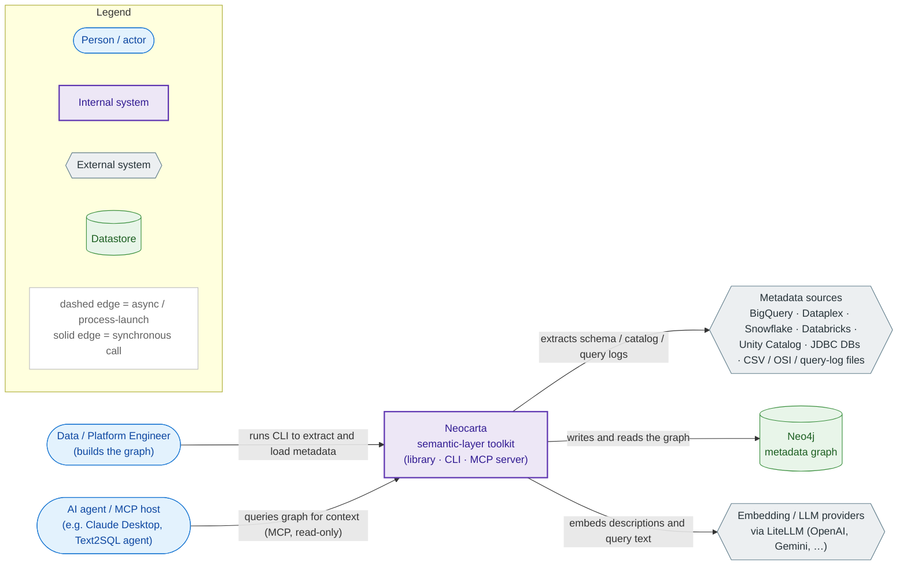
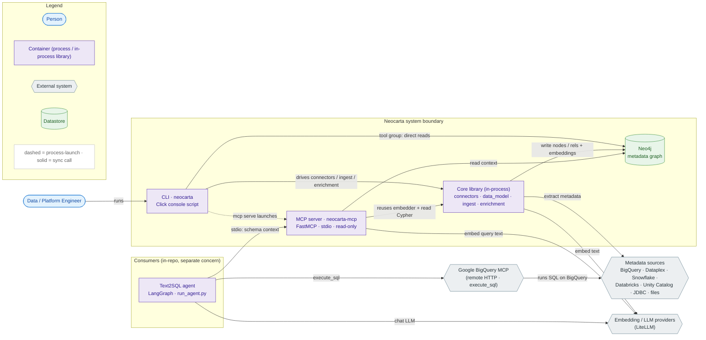
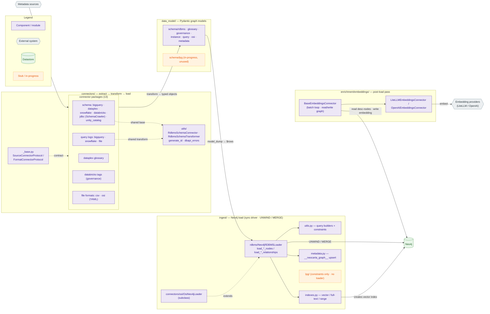
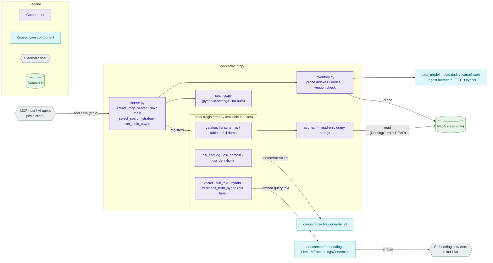
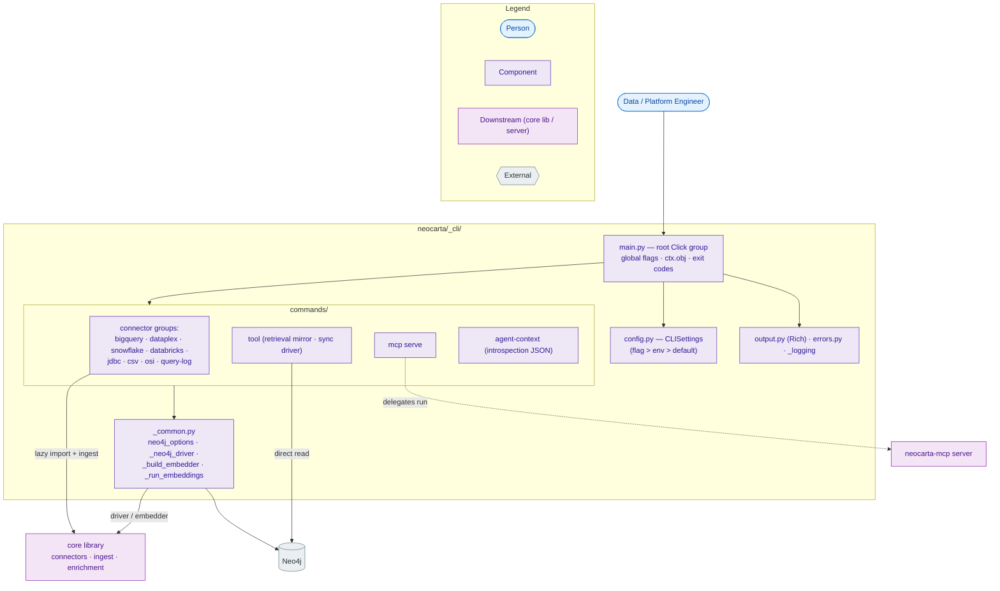
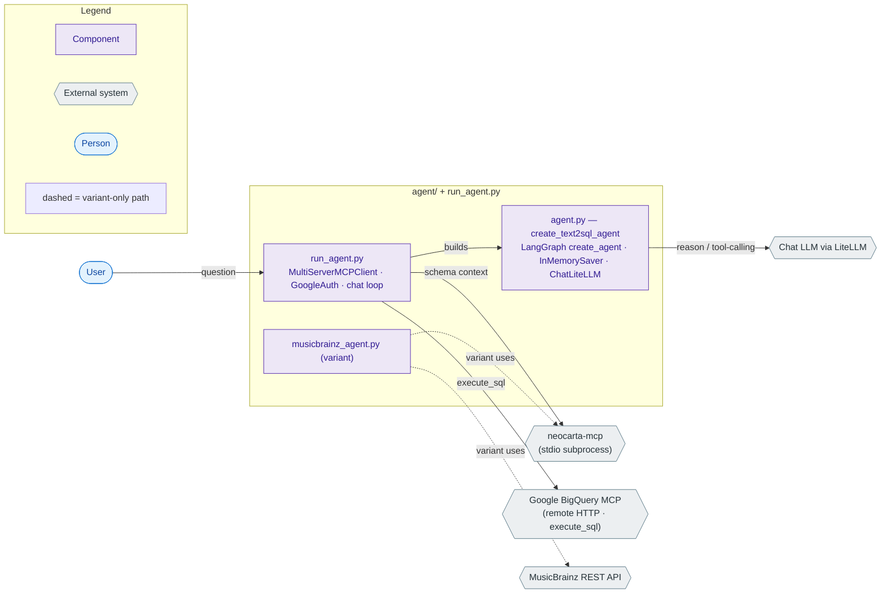

# Neocarta — Current-State Architecture

> **Scope & status.** This document describes the **current** (as-built) architecture of the
> repository, grounded in the code as of this writing. It is a *snapshot*, not a target design —
> the planned refactor/target state is deliberately out of scope. Every claim links to the source
> path that backs it; anything not directly verifiable in code is called out in
> **[Assumptions & Unknowns](#assumptions--unknowns)**.
>
> Diagrams follow the **C4 model** (Context → Containers → Components), one file per level under
> [`docs/architecture/`](.). They are authored in Mermaid `flowchart` and validated with
> `mermaid-cli`.

## Conventions used in every diagram

| Shape | Meaning |
|---|---|
| Stadium `(text)` | Person / actor |
| Rectangle `[text]` | Internal system / container / component |
| Hexagon `{{text}}` | External system |
| Cylinder `[(text)]` | Datastore |
| Dashed edge | Process-launch or variant-only path |
| Solid edge | Synchronous call |
| Dashed orange node | Stub / in-progress (not a live path) |

---

## What Neocarta is

Neocarta is a **`uv`-managed, PyPI-distributed Python library** (`name = "neocarta"`, `version = 0.8.0`,
hatchling build backend — [pyproject.toml](../../pyproject.toml)) that builds a **semantic-layer
metadata graph in Neo4j**. It extracts schema/catalog/query-log metadata from data sources, transforms
it into Pydantic models, loads it into Neo4j, optionally enriches nodes with vector embeddings, and
optionally serves the graph read-only to AI agents over MCP.

There is **no hosted service**. "Deployment" is `pip install neocarta`; the two console entry points are
`neocarta` (CLI) and `neocarta-mcp` (MCP server) ([pyproject.toml](../../pyproject.toml) `[project.scripts]`).
CI is Ruff + a pytest matrix (Py 3.10–3.13) + release-to-PyPI on a `neocarta-v*` tag
([.github/workflows/](../../.github/workflows/)).

---

## Level 1 — System Context

Source: [`current-context.mmd`](current-context.mmd)



**Actors.** A **Data / Platform Engineer** drives the CLI to populate the graph. An **AI agent / MCP
host** (Claude Desktop, or the repo's own Text2SQL agent) reads the graph for schema context via MCP.

**External dependencies.** *Metadata sources* are read during extraction; *Neo4j* is the store Neocarta
owns the schema of (but does **not** deploy — see Assumptions); *embedding/LLM providers* are reached
through LiteLLM for both ingest-time embeddings and query-time embeddings.

---

## Level 2 — Containers

Source: [`current-containers.mmd`](current-containers.mmd)



### Containers

| Container | Responsibility | Key paths | Data it owns |
|---|---|---|---|
| **CLI** (`neocarta`) | Primary operator interface. Drives connectors → ingest → enrichment; also runs the retrieval `tool` group and launches the MCP server. Click-based. | [neocarta/_cli/](../../neocarta/_cli/) | None (stateless; reads/writes Neo4j) |
| **MCP server** (`neocarta-mcp`) | Exposes the graph **read-only** to AI agents over **stdio**. Dynamically registers retrieval tools based on which indexes exist. | [neocarta/_mcp/](../../neocarta/_mcp/) | None (read-only over Neo4j) |
| **Core library** (in-process) | The substance: extract/transform/load + embeddings. Embedded by both CLI and MCP; **not** a separate process. | [connectors/](../../neocarta/connectors/), [data_model/](../../neocarta/data_model/), [ingest/](../../neocarta/ingest/), [enrichment/](../../neocarta/enrichment/) | The Neo4j graph schema (via `NodeLabel`/`RelationshipType` in [enums.py](../../neocarta/enums.py)) |
| **Neo4j** | The metadata graph store. User-operated. | external | All nodes/rels/embeddings/indexes |
| **Text2SQL agent** *(consumer, separate concern)* | Demo LangGraph agent: gets schema context from `neocarta-mcp`, runs SQL via Google's BigQuery MCP. | [run_agent.py](../../run_agent.py), [agent/](../../agent/) | Conversation state (`InMemorySaver`) |

**On the "core library" as a container.** In C4 terms it is a shared **in-process library**, not a
runnable process — but it is the architectural heart, so it is drawn as one box at L2 and decomposed at
L3. The Neo4j `Driver` is **dependency-injected** into it from whichever process hosts it (CLI builds a
sync driver in [_common.py](../../neocarta/_cli/commands/_common.py); MCP builds an async driver in
[server.py](../../neocarta/_mcp/server.py)); the core packages never construct a driver themselves.

**Notable container-level edges.**
- `CLI → Neo4j` directly: the `tool` command group mirrors the MCP retrieval tools against a **sync**
  driver, bypassing the server ([neocarta/_cli/commands/tool.py](../../neocarta/_cli/commands/tool.py)).
- `CLI ⇢ MCP server` (dashed): `neocarta mcp serve` launches the same `run()` entry point as the
  `neocarta-mcp` script ([neocarta/_cli/commands/mcp.py](../../neocarta/_cli/commands/mcp.py)).
- The agent reaches Neo4j **only** through the MCP subprocess (which holds the Neo4j creds); it holds no
  Neo4j or BigQuery client of its own.

*Out of the diagrammed boundary (dev/demo tooling, described but not drawn):* `eval/` (retrieval-vs-full-schema
A/B harness that launches its own MCP session and re-implements SQL-gen with raw OpenAI —
[eval/runner.py](../../eval/runner.py)); `examples/` (per-connector runnable scripts); `datasets/`
(sample data loaders for BigQuery/Neo4j).

---

## Level 3 — Components

### 3a. Core build pipeline (connectors → data_model → ingest → enrichment)

Source: [`current-components-core-pipeline.mmd`](current-components-core-pipeline.mmd) — *the densest view; see the density readout.*



**The pattern.** Every connector is a package of `extract.py` → `transform.py` → (loader) with a
`connector.py` orchestrator, conforming structurally to two `typing.Protocol`s in
[connectors/_base.py](../../neocarta/connectors/_base.py): `SourceConnectorProtocol`
(`extract`/`transform`/`load`/`ingest`/`close`/context-manager) and `FormatConnectorProtocol` (adds
`export`). Stage guards raise `StateError` if called out of order. `ingest()` runs all three stages then
stamps the `__neocarta_graph__` metadata node.

**Components.**

- **`connectors/`** — 13 connector packages, grouped in the diagram by family:
  - *schema*: `bigquery` (`google-cloud-bigquery`), `dataplex` (`google-cloud-dataplex`),
    `snowflake` (`snowflake-connector-python`, DB-API), `databricks` (`databricks-sql-connector`, DB-API),
    `jdbc` (shells out to the **SchemaCrawler** Java CLI via `subprocess`), `unity_catalog` (`httpx` REST).
  - *query logs*: `bigquery/logs`, `snowflake/logs`, and file-based `query_log` — all reuse
    `QueryLogTransformer` and `sqlglot`-based SQL parsing ([connectors/query_log/](../../neocarta/connectors/query_log/)).
  - *glossary*: `dataplex/glossary` (Glossary/Category/BusinessTerm + `TAGGED_WITH`).
  - *governance*: `databricks/tags` (`databricks-sdk`, governed-tag definitions).
  - *file formats*: `csv` (pandas), `osi` (OSI YAML via `httpx`+`PyYAML`; the only connector implementing `export`).
  - **`connectors/utils/`** — cross-cutting shared code: `RdbmsSchemaConnector` /
    `RdbmsSchemaTransformer` (base for Snowflake + Databricks schema), `generate_id` (the deterministic
    ID-scheme authority for **all** node kinds), `dbapi_errors` (DB-API exception → `NeocartaError`).
- **`data_model/`** — Pydantic v2 models, one subpackage per graph layer: `schema/rdbms`, `glossary`,
  `governance`, `instance`, `query`, `osi`, `metadata` (the `NeocartaGraph` singleton). OSI subtypes
  inherit from RDBMS structural models and are stored as multi-labelled nodes (`:Table:OsiTable`).
  Description-bearing nodes carry an `embedding: list[float] | None`. **There is no top-level aggregate
  object** — the connector↔ingest contract is *lists of individual models* passed to per-type loader
  methods. `schema/lpg` is present but **warns "in-progress … no application"** on import.
- **`ingest/`** — `Neo4jRDBMSLoader` ([ingest/rdbms/load.py](../../neocarta/ingest/rdbms/load.py)) is the
  loader: **synchronous**, `driver.execute_query(..., routing_=RoutingControl.WRITE)`, one
  `UNWIND $rows … MERGE` round-trip per node/relationship type (builders in
  [ingest/utils.py](../../neocarta/ingest/utils.py)). `indexes.py` creates vector/full-text/range
  indexes; `constraints.py` chooses NODE KEY (Enterprise) vs uniqueness (Community); `metadata.py` upserts
  the graph-version node. `OsiNeo4jLoader` subclasses the loader for OSI node types but lives under
  `connectors/osi/` ([load.py](../../neocarta/connectors/osi/load.py)). **`ingest/lpg/` is constraints
  only — no loader exists**, matching the LPG data-model stub.
- **`enrichment/embeddings/`** — a **separate post-load pass**. `BaseEmbeddingsConnector`
  ([base.py](../../neocarta/enrichment/embeddings/base.py)) owns the batch loop and graph read/write;
  provider subclasses (`LiteLLMEmbeddingsConnector`, `OpenAIEmbeddingsConnector`) implement the embedding
  call. It reads nodes `WHERE n.description IS NOT NULL AND n.embedding IS NULL`, writes the `embedding`
  property via `db.create.setNodeVectorProperty`, and relies on `ingest.indexes` for the vector index.

### 3b. MCP server (read path)

Source: [`current-components-mcp.mmd`](current-components-mcp.mmd)



**Bootstrap.** `run()` → `asyncio.run(main())` builds an **async** Neo4j driver + an embedder, calls
`create_mcp_server()`, then `await server.run_stdio_async()` — **stdio transport only; no HTTP path**
([_mcp/server.py](../../neocarta/_mcp/server.py)). `create_mcp_server()` validates the graph version
against the `__neocarta_graph__` node and probes which indexes/nodes exist.

**Dynamic tool registration.** `_select_search_strategy()` picks **one** strategy per label by priority
(`business_term_hybrid > hybrid > vector/full_text`) based on available indexes, so the exposed tool set
is graph-dependent. Tool families ([_mcp/tools/](../../neocarta/_mcp/tools/)): `catalog` (always on),
per-label search (`vector`/`full_text`/`hybrid`/`business_term_hybrid`), and OSI tools
(`osi_catalog`/`osi_domain`/`osi_definitions`, registered only when `:OsiSemanticModel` nodes exist).

**Read-only & reuse.** Every query uses `RoutingControl.READ`; no Cypher string mutates
([_mcp/cypher/](../../neocarta/_mcp/cypher/)). The server **reuses** three core components (teal in the
diagram): the `LiteLLMEmbeddingsConnector` (so query vectors match stored vectors), `generate_id` (OSI
lookups), and `data_model.metadata.NeocartaGraph` + the ingest FETCH Cypher (version check).

**Auth.** **None** — `FastMCP(...)` is constructed with no auth provider; access control is delegated to
the stdio host (e.g. Claude Desktop). See Assumptions.

### 3c. CLI (`neocarta`)

Source: [`current-components-cli.mmd`](current-components-cli.mmd)



**Structure.** Root Click group in [main.py](../../neocarta/_cli/main.py) with global flags
(`--json`/`--log-level`/`--debug`/`--no-color`/`-v`) and shared state on `ctx.obj`. Ten command groups are
registered explicitly ([main.py](../../neocarta/_cli/main.py)). Commands **lazy-import** their vendor SDK
+ connector inside the handler (after `--dry-run`/`--help` short-circuits).

**Components.**
- **`commands/`** — connector groups (`bigquery`, `dataplex`, `snowflake`, `databricks`, `jdbc`, `csv`,
  `osi`, `query-log`), each with verbs like `schema`/`logs`/`glossary`/`tags`/`ingest`/`export`; `mcp serve`
  (delegates to the server `run()`); `tool` (12 subcommands mirroring the MCP retrievals against a sync
  driver, reusing `_mcp.cypher`/`_mcp.models`); and `agent-context` (emits the whole command tree +
  exit-codes + env-vars as JSON).
- **`_common.py`** — shared plumbing: `neo4j_options` decorator, `_neo4j_driver` context manager
  (`GraphDatabase.driver`), `_build_embedder` (→ `LiteLLMEmbeddingsConnector`), `_run_embeddings`.
- **`config.py`** — `CLISettings` (pydantic-settings) with resolution order **flag > env (`.env`) > default**;
  Neo4j password is **env-only by design** (never a flag), secrets held as `SecretStr`.
- **`output.py` / `errors.py`** — Rich two-stream discipline (stdout = result, stderr = diagnostics),
  auto-JSON when stdout is not a TTY, and a closed `EXIT_CODES` map surfaced through `CLIError`.

### 3d. Text2SQL agent (consumer)

Source: [`current-components-agent.mmd`](current-components-agent.mmd)



**Flow.** [run_agent.py](../../run_agent.py) builds a `MultiServerMCPClient` (`langchain-mcp-adapters`)
wired to **two** MCP servers: `neocarta-mcp` (launched as a `uv run neocarta-mcp` **stdio subprocess**,
which holds the Neo4j creds) for schema context, and Google's **BigQuery MCP** (remote HTTP, authed with a
custom `GoogleAuth(httpx.Auth)` injecting ADC bearer tokens) for the single allowlisted `execute_sql`
tool. [agent/agent.py](../../agent/agent.py) builds the LangGraph agent (`create_agent` + `InMemorySaver`
+ `ChatLiteLLM`, model from `AGENT_MODEL`). The `musicbrainz_agent.py` variant swaps BigQuery for the live
MusicBrainz REST API.

---

## Cross-cutting concerns

- **Configuration.** `pydantic-settings` + `python-dotenv` in two places — CLI
  ([_cli/config.py](../../neocarta/_cli/config.py)) and MCP ([_mcp/settings.py](../../neocarta/_mcp/settings.py)) —
  both reading the same `.env` surface ([.env.example](../../.env.example)). Resolution order: flag > env > default.
- **Graph vocabulary.** All Cypher labels/relationship types come from `NodeLabel`/`RelationshipType`
  in [enums.py](../../neocarta/enums.py); node IDs from the deterministic `generate_id` authority — shared
  by connectors (write) and MCP/CLI (lookup), keeping write and read sides consistent.
- **Error handling.** `neocarta/errors.py` (`NeocartaError`, `ConfigError`, `StateError`) is the library
  surface; the CLI maps these to a closed exit-code table via `CLIError`; connectors translate DB-API
  driver exceptions with `connectors/utils/dbapi_errors`.
- **Neo4j driver ownership.** Always dependency-injected; sync driver on the CLI/ingest/enrichment side,
  async driver in the MCP server. No shared factory in the core packages.
- **Embedding consistency.** The MCP server reuses the *same* `LiteLLMEmbeddingsConnector` used at ingest
  time so query-time and stored vectors are dimension- and model-aligned (`EMBEDDING_DIMENSIONS` exists to
  keep them aligned).
- **Optionality via extras.** `mcp`, `cli`, `databricks`, `snowflake`, `performance` (Rust driver), plus
  dependency-groups `agent`, `eval`, `dev` ([pyproject.toml](../../pyproject.toml)). Vendor SDKs are
  lazily imported so a missing extra fails only when that connector is actually used.
- **Observability.** Structured stage/count logging (`_logging.log_stage`, `log_transform_counts`) across
  connectors; Rich logging on stderr in the CLI. No metrics/tracing exporter.

### Implicit / undocumented in code (confirmed by absence)

- **No MCP auth**, and **stdio-only** transport — network exposure and authz are entirely the host's
  responsibility.
- **No message queue, event bus, or async task system** — the entire write path is synchronous and
  in-process; the only "async" is the MCP server's async Neo4j driver and the agent's streaming.
- **No batching/chunking** inside the loader beyond one `$rows` payload per type (see Assumptions).
- **LPG path is a stub** (`data_model/schema/lpg` warns "no application"; `ingest/lpg/` has no loader).

---

## Assumptions & Unknowns

| # | Statement | Status | Basis |
|---|---|---|---|
| 1 | Neo4j is drawn as a datastore **inside** the system boundary, but Neocarta does **not deploy/operate** it — the user provides a running instance and creds. | **Modeling choice** | `.env` creds + injected driver; no provisioning code. |
| 2 | Connectors never own the Neo4j driver lifecycle (`close()` is a no-op except for source clients like `unity_catalog`'s httpx). | **Inferred** | Uniform `close()` docstrings ("injected driver is the caller's"); not a single enforced contract. |
| 3 | The connector↔ingest contract is *lists of individual Pydantic models*, with **no top-level aggregate** container object. | **Confirmed** | Loader method signatures + connector `load()` bodies. |
| 4 | The loader sends each node/rel type as one `UNWIND $rows` round-trip with **no sub-batching**. | **Inferred** | No chunking logic seen in `ingest/utils.py`; whole list passed as `$rows`. |
| 5 | `FormatConnectorProtocol` (with `export`) is implemented **only by OSI** today; CSV is effectively ingest-only despite docs calling it a format connector. | **Confirmed** | No `export` in `csv/connector.py`. |
| 6 | The intended full loop is *connector → Neo4j → neocarta-mcp → agent/eval → SQL on BigQuery*; the agent and eval are **independent** MCP consumers (eval does not import `agent/`). | **Confirmed** | `run_agent.py`, `eval/runner.py`. |
| 7 | `agent/`, `eval/`, `examples/`, `datasets/` are **separate concerns** from the shipped library; only the agent is drawn (as an external consumer) per the chosen scope. | **Scope decision** | CLAUDE.md + reviewer direction. |
| 8 | The "core library" is not a runnable process — it is drawn as a container only to anchor the L3 decomposition. | **Modeling choice** | It has no entry point; embedded in CLI/MCP. |
| 9 | Diagrams render as valid Mermaid. | **Verified** | `mermaid-cli` produced SVGs for all six files. |

### How to regenerate / validate the diagrams

```bash
# validate + render any file
npx -y -p @mermaid-js/mermaid-cli mmdc -i docs/architecture/current-context.mmd -o /tmp/out.svg
```
