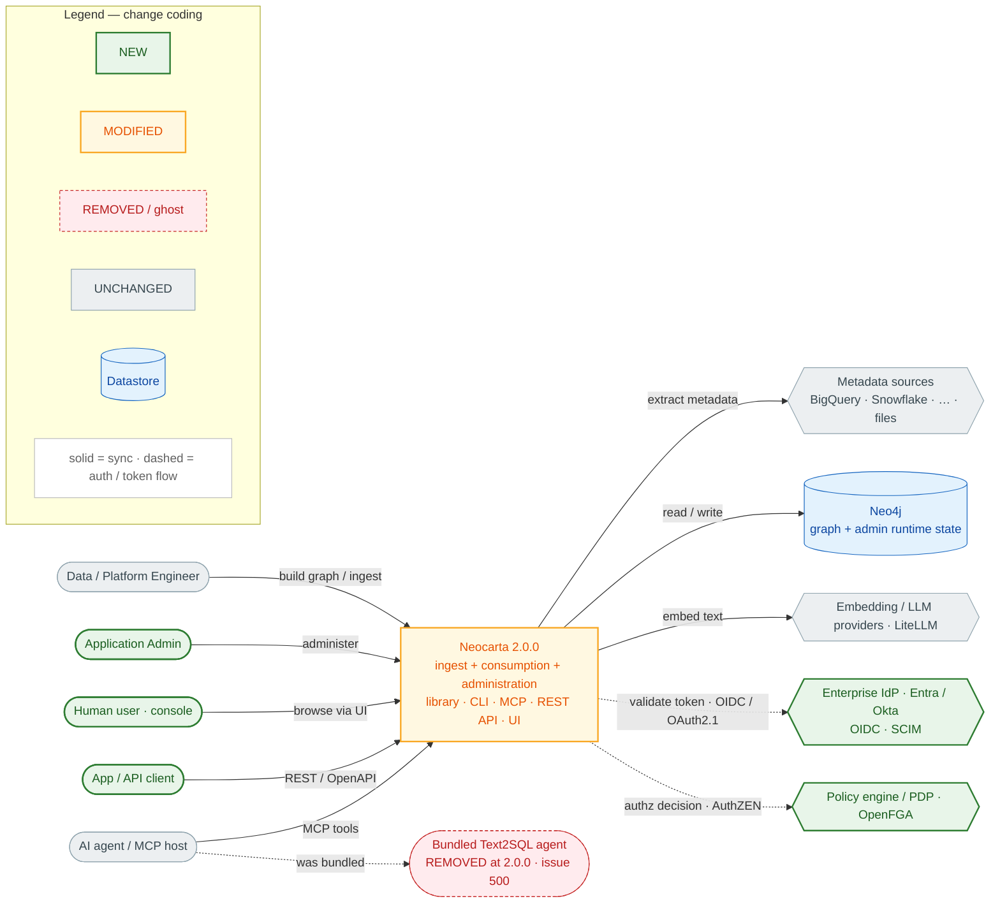
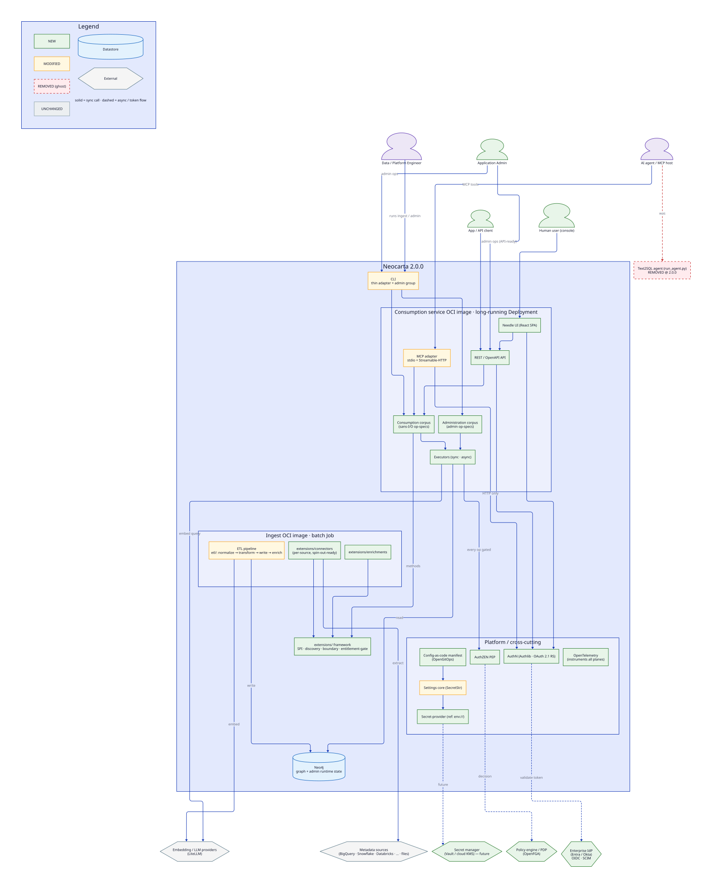
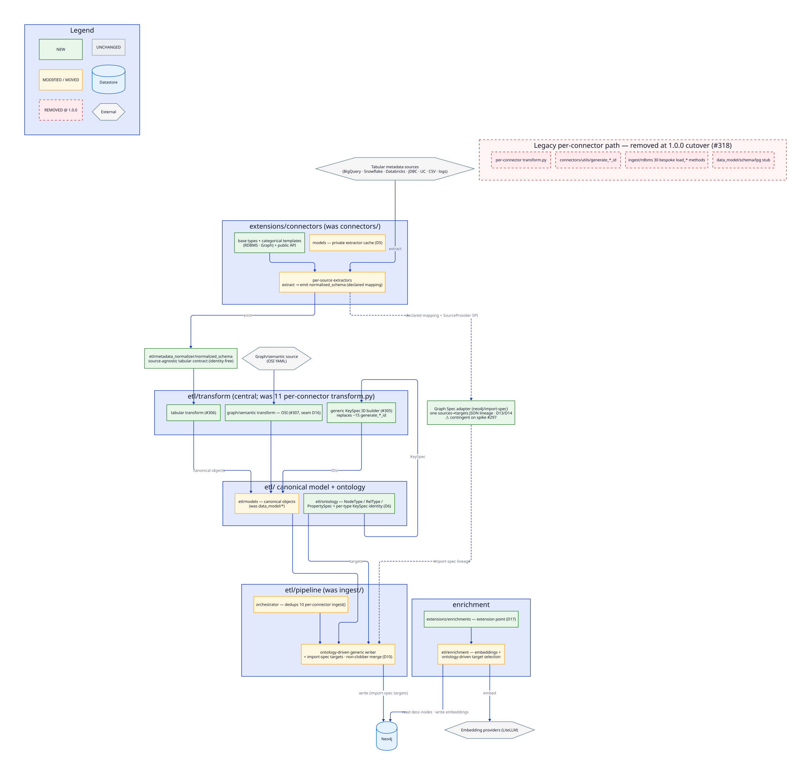
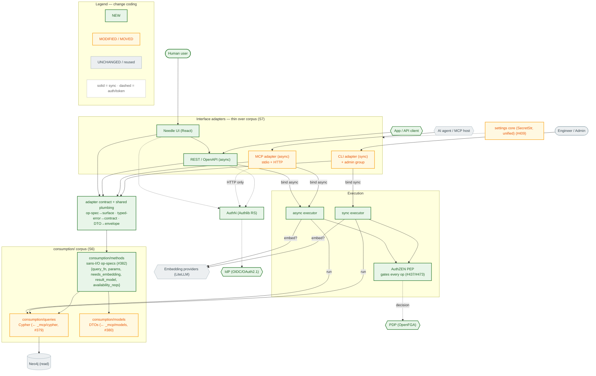
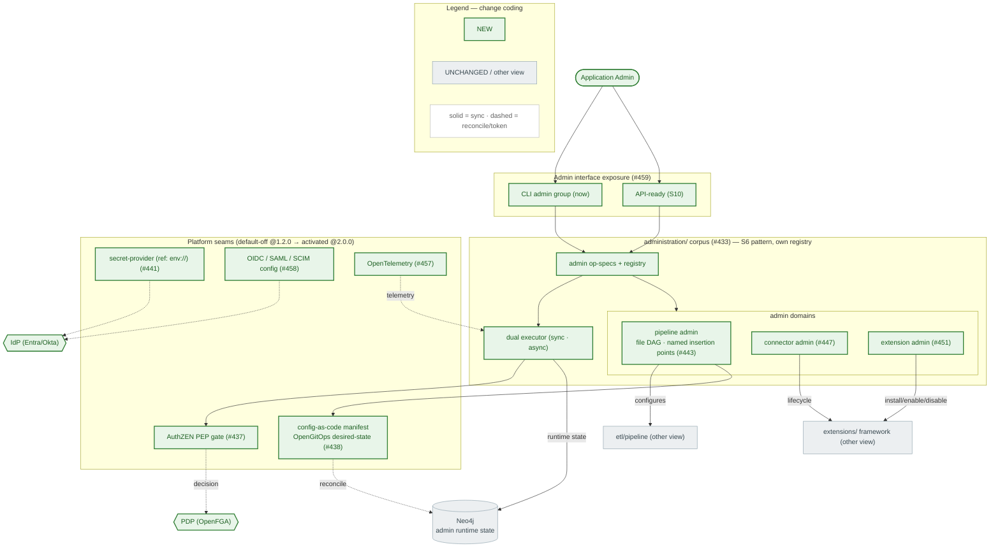

# Neocarta — Target-State Architecture (Production Refactor)

> **Scope & status.** This documents the **target** architecture that GitHub Project 12
> ([Neocarta Production Refactor](https://github.com/orgs/neo4j-labs/projects/12)) drives, layered on top of
> [`current-state.md`](current-state.md). The authority for the target shape is
> [`docs/refactor/GUIDE.md`](../refactor/GUIDE.md) (§5 target tree, §7 delta glossary); every architectural
> change below traces to one or more of the project's 226 tickets in the
> [Traceability Matrix](#traceability-matrix).
>
> The refactor is **one coherent end-state reached in six release bands** (0.8.1 → 2.0.0) with **two
> intentional major breaks**. The diagrams show the **2.0.0 end-state**, change-coded against current;
> the [Sequencing](#sequencing) section and the per-band container overlays show what lands when.
>
> **Grounding & caveats.** As of this branch the `etl/`/`extensions/` scaffolding (S0.5 #286) is not yet
> merged here, so the target tree is taken from GUIDE §5, not from disk. Everything marked ⚠ is a
> **contingency** (chiefly the #297 Graph Spec spike). Nothing here is invented: each element cites either
> current code or a specific ticket.

## Change-coding (all diagrams)

| Code | Meaning |
|---|---|
| 🟩 **NEW** | Element introduced by a ticket; no current-state equivalent |
| 🟨 **MODIFIED / MOVED** | Current element with changed responsibility, interface, or location |
| 🟥 **REMOVED** | Current element deleted (shown ghosted/dashed, not erased) |
| ⬜ **UNCHANGED** | Carried over as-is |

Diagrams are **Mermaid** except **`target-containers.d2`** and **`target-components-core-pipeline.d2`**,
which are **D2** — the target container and core-pipeline views are dense (the core-pipeline component
view was already flagged in the current-state pass, and the target adds cross-cutting auth/observability/
config edges). D2's layout engine handles the many-to-many edges better. See the
[Density readout](#density--format-readout).

---

## Level 1 — System Context (target 2.0.0)

Source: [`target-context.mmd`](target-context.mmd)



**What changes at the context boundary.** Neocarta gains **three new caller classes** — an *Application
Admin* (administration surface, S9), a *Human user* (Needle UI, S7 #466), and an *App/API client* (REST
API, S7 #465) — and **two new external dependencies**: an enterprise **IdP** (Entra/Okta via OIDC/SCIM,
S10) and an external **PDP** (OpenFGA, S10). The **bundled Text2SQL agent is removed** (S12 #500); external
agents still consume via MCP. Metadata sources, embedding providers, and Neo4j are unchanged (Neo4j now
also stores admin runtime state, D-S9-1).

---

## Level 2 — Containers (target 2.0.0 end-state) — D2

Source: **[`target-containers.d2`](target-containers.d2)** (render: `d2 target-containers.d2 out.svg`).
Pre-rendered (updates only when you re-run the render command):



This view is authored in **D2** because it is dense (~22 nodes; many-to-many auth/observability/config
edges). Summary of the container delta:

- **Ingest OCI image (batch Job)** 🟩 — hosts the `etl/` pipeline 🟨 (from `ingest/`+connectors transform)
  and `extensions/connectors` 🟩 / `extensions/enrichments` 🟩; **composable** (only enabled connectors'
  system deps, e.g. JDBC's JVM) (#489, D-S11-5).
- **Consumption service OCI image (long-running Deployment)** 🟩 — the `consumption` corpus 🟩 +
  `administration` corpus 🟩 + executors 🟩 behind the **MCP adapter** 🟨, **REST API** 🟩, and **Needle
  UI** 🟩 (#485, D-S11-1/2).
- **`extensions/` framework** 🟩 — one SPI + discovery + boundary + entitlement-gate (#418).
- **Platform / cross-cutting** 🟩 — settings core 🟨 (SecretStr), config-as-code manifest 🟩,
  secret-provider 🟩, **AuthZEN PEP** 🟩 (gates *every* op-spec), **AuthN** 🟩 (Authlib), **OpenTelemetry** 🟩.
- **CLI** 🟨 — thin adapter over the corpus + a new admin group.
- **Neo4j** ⬜ — unchanged store (+ admin runtime state).
- **Text2SQL agent** 🟥 — removed.

Per-container target responsibilities and their current-state origins are in the
[Traceability Matrix](#traceability-matrix).

---

## Level 3 — Components

### 3a. Core build pipeline — D2

Source: **[`target-components-core-pipeline.d2`](target-components-core-pipeline.d2)**. Mirrors
[`current-components-core-pipeline.mmd`](current-components-core-pipeline.mmd), change-coded.



The ingest half is rebuilt into the GUIDE §5 tree: connectors shrink to **`extract → emit
normalized_schema`** 🟨 (#315/#317) as **`extensions/connectors`** artifacts 🟩 (base types + RDBMS/Graph
categorical templates + public API, #321); the flat **`etl/metadata_normalizer/normalized_schema`** 🟩
(#310) decouples them from the ontology. One **central `etl/transform`** 🟩 (tabular #306 + graph/OSI #307)
with a **generic KeySpec ID builder** 🟩 (#305) replaces the 11 per-connector `transform.py` 🟥 and the
~15 `generate_*_id` functions 🟥. **`etl/models` + `etl/ontology`** (canonical objects + NodeType/RelType/
PropertySpec/KeySpec) 🟩 replace `data_model/*`. **`etl/pipeline`** 🟨 provides one orchestrator + one
**ontology-driven generic writer** (= import-spec `targets`, non-clobber merge D10) replacing the 30
bespoke `load_*` methods 🟥. The whole lineage is expressible as one Neo4j-native **Graph Spec** ⚠ (D14,
contingent on #297).

### 3b. Consumption corpus + interface adapters — Mermaid

Source: [`target-components-consumption.mmd`](target-components-consumption.mmd). **Supersedes both**
[`current-components-mcp.mmd`](current-components-mcp.mmd) **and**
[`current-components-cli.mmd`](current-components-cli.mmd) — MCP and CLI collapse into thin adapters over
one shared corpus.



The method logic re-implemented twice today (async FastMCP tools vs sync Click `tool` group) becomes one
set of **sans-I/O op-specs** 🟩 (#382) interpreted by **two executors** 🟩 (sync/async, #377). Each interface
**binds its executor once** and maps op-spec→surface, typed-error→contract, DTO→envelope (D-S7-2). A single
**AuthZEN PEP** 🟩 at the executor boundary gates every op (consumption + admin) — the density-driving
cross-cut (D-S10-3).

### 3c. Administration corpus + platform seams — Mermaid

Source: [`target-components-administration.mmd`](target-components-administration.mmd). **Entirely
net-new** (no current-state equivalent).



Administration is a **separate corpus** reusing the S6 op-spec + dual-executor pattern with its own
registry (D-S9-3). Declared config lives in a **config-as-code manifest** (OpenGitOps desired-state +
reconcile, D-S9-1), runtime state in the graph, secrets behind a **provider interface** (env-only floor,
D-S9-7). The application-admin seams (PEP, OIDC/SCIM, OTel) ship **default-off at 1.2.0** and are activated
by S10 at 2.0.0.

---

## Sequencing

The tickets imply **distinct migration phases**, not a single cutover — so the end-state above is reached
through six bands. Per-band container overlays:

| Band | Semver | Overlay | What lands | Break? |
|---|---|---|---|---|
| **0.8.1** | patch | *(done)* | Safety net: coverage, markers, CI gate, golden-master harness, empty scaffolding | no |
| **0.9.x** | minor | *(component-level; see core-pipeline)* | `etl/*` + `extensions/*` built **alongside** legacy, parity held | no |
| **1.0.0** | **major** | [`target-containers-band-1.0.0.mmd`](target-containers-band-1.0.0.mmd) | Connector cutover; legacy transform/model/loader removed; connector-authoring contract breaks; `run()` removed | **⚠ break #1** |
| **1.1.0** | minor | [`target-containers-band-1.1.0.mmd`](target-containers-band-1.1.0.mmd) | Consumption corpus + executors; MCP/CLI → thin adapters; REST API + Needle UI **built but gated** | no |
| **1.2.0** | minor | [`target-containers-band-1.2.0.mmd`](target-containers-band-1.2.0.mmd) | `extensions/` framework; `administration/` corpus; platform seams **default-off** | no |
| **2.0.0** | **major** | [`target-containers.d2`](target-containers.d2) *(end-state)* | AuthN/AuthZ activated (#479 removes the dev gate); two OCI images; **agent removed** | **⚠ break #2** |

**Two majors, two different breaks:** 1.0.0 breaks the **connector-authoring API** (end-users/`ingest()`
unaffected); 2.0.0 breaks by making **caller auth mandatory** on the network surfaces (local stdio-MCP +
CLI stay unauthenticated) and removing the bundled agent.

---

## Traceability Matrix

Each row: architectural change → **type** → driving ticket(s) → **current** source path(s) it affects.
Ticket URL pattern: `https://github.com/neo4j-labs/neocarta/issues/<n>`.

### Ingest half — `etl/` + `extensions/` (bands 0.9.x → 1.0.0)

| Change | Type | Ticket(s) | Current source path(s) |
|---|---|---|---|
| `etl/metadata_normalizer/normalized_schema` — source-agnostic tabular contract | ADD | [#310](https://github.com/neo4j-labs/neocarta/issues/310); ⚠[#297](https://github.com/neo4j-labs/neocarta/issues/297) | `neocarta/connectors/models.py`, `neocarta/connectors/*/transform.py` |
| `etl/models` + `etl/ontology` (NodeType/RelType/PropertySpec + KeySpec) | MOVE + ADD | [#299](https://github.com/neo4j-labs/neocarta/issues/299), [#311](https://github.com/neo4j-labs/neocarta/issues/311), [#300](https://github.com/neo4j-labs/neocarta/issues/300) | `neocarta/data_model/*`, `neocarta/enums.py` |
| Generic KeySpec ID builder replaces ~15 `generate_*_id` | REPLACE | [#305](https://github.com/neo4j-labs/neocarta/issues/305) (D6) | `neocarta/connectors/utils/generate_id.py` |
| Central `etl/transform` (tabular + graph/OSI) | ADD / REPLACE | [#312](https://github.com/neo4j-labs/neocarta/issues/312), [#306](https://github.com/neo4j-labs/neocarta/issues/306), [#307](https://github.com/neo4j-labs/neocarta/issues/307) | 11× `connectors/*/transform.py`, `connectors/osi/*/transform.py` |
| `extensions/connectors` (base types + RDBMS/Graph templates + public API) | MOVE + ADD | [#316](https://github.com/neo4j-labs/neocarta/issues/316), [#321](https://github.com/neo4j-labs/neocarta/issues/321) | `neocarta/connectors/<src>/`, `connectors/_base.py` |
| Connector flip to normalized-schema emission | MOVE | [#317](https://github.com/neo4j-labs/neocarta/issues/317) | `neocarta/connectors/*/extract.py` |
| **Connector-authoring contract break** (`transform`/`load`/`run` removed; `ingest()` stays) | MODIFY | [#315](https://github.com/neo4j-labs/neocarta/issues/315), [#318](https://github.com/neo4j-labs/neocarta/issues/318) | `connectors/_base.py`, `.claude/skills/neocarta-add-source-connector/connector-contract.md` |
| Spin-out boundary + import-spec discovery/registration SPI | ADD | [#322](https://github.com/neo4j-labs/neocarta/issues/322) (D17) | *(none — new)* |
| `etl/pipeline` orchestrator + ontology-driven generic writer | REPLACE | [#323](https://github.com/neo4j-labs/neocarta/issues/323), [#324](https://github.com/neo4j-labs/neocarta/issues/324), [#314](https://github.com/neo4j-labs/neocarta/issues/314) | `neocarta/ingest/rdbms/load.py`, `neocarta/ingest/*` |
| `etl/enrichment` + `extensions/enrichments` extension point | MOVE + ADD | [#328](https://github.com/neo4j-labs/neocarta/issues/328), [#369](https://github.com/neo4j-labs/neocarta/issues/369) | `neocarta/enrichment/embeddings/*` |
| Graph Spec adapter (Neo4j-native ontology substrate) ⚠ | ADD | [#301](https://github.com/neo4j-labs/neocarta/issues/301), [#367](https://github.com/neo4j-labs/neocarta/issues/367) (D13/D14) | `neocarta/data_model/schema/lpg` (stub) |

### Consumption half — `consumption/` + interfaces (band 1.1.0)

| Change | Type | Ticket(s) | Current source path(s) |
|---|---|---|---|
| `consumption/queries` ← relocate Cypher | MOVE | [#379](https://github.com/neo4j-labs/neocarta/issues/379) | `neocarta/_mcp/cypher/*` |
| `consumption/models` ← relocate DTOs | MOVE | [#380](https://github.com/neo4j-labs/neocarta/issues/380) | `neocarta/_mcp/models.py` |
| `consumption/methods` — sans-I/O op-specs (1:1 per tool) | ADD / REPLACE | [#382](https://github.com/neo4j-labs/neocarta/issues/382), [#377](https://github.com/neo4j-labs/neocarta/issues/377) | `neocarta/_mcp/tools/*`, `neocarta/_cli/commands/tool.py` |
| Two executors (sync · async) | ADD | [#377](https://github.com/neo4j-labs/neocarta/issues/377) | *(embedder/driver sync+async already exist)* |
| Adapter contract + shared plumbing | ADD | [#397](https://github.com/neo4j-labs/neocarta/issues/397) | `neocarta/_cli/commands/_common.py`, `neocarta/_mcp/server.py` |
| MCP adapter (regenerated over corpus, async) | MODIFY | [#398](https://github.com/neo4j-labs/neocarta/issues/398) | `neocarta/_mcp/server.py` |
| CLI adapter (over corpus, sync) + admin group | MODIFY | [#403](https://github.com/neo4j-labs/neocarta/issues/403) | `neocarta/_cli/commands/tool.py`, `_cli/main.py` |
| REST / OpenAPI API (built local-only, gated) | ADD | [#465](https://github.com/neo4j-labs/neocarta/issues/465) | *(none — new)* |
| Needle React UI (built local-only demo) | ADD | [#466](https://github.com/neo4j-labs/neocarta/issues/466) | *(none — new)* |
| Unified settings core (SecretStr; manifest layer) | MODIFY | [#409](https://github.com/neo4j-labs/neocarta/issues/409), [#438](https://github.com/neo4j-labs/neocarta/issues/438) | `neocarta/_cli/config.py`, `neocarta/_mcp/settings.py` |

### Extension framework (band 1.2.0)

| Change | Type | Ticket(s) | Current source path(s) |
|---|---|---|---|
| Unified extension SPI + discovery + boundary + entitlement-gate | ADD | [#418](https://github.com/neo4j-labs/neocarta/issues/418) | *(generalizes #321/#322/#328 RP-A slices)* |
| `extensions/methods` — consumption-methods extension point | ADD | [#425](https://github.com/neo4j-labs/neocarta/issues/425) | `neocarta/_mcp/tools/*` (S6 op-specs) |

### Administration (band 1.2.0)

| Change | Type | Ticket(s) | Current source path(s) |
|---|---|---|---|
| `administration/` corpus + admin-method framework | ADD | [#433](https://github.com/neo4j-labs/neocarta/issues/433) | *(none — new)* |
| Config-as-code manifest (OpenGitOps) | ADD | [#438](https://github.com/neo4j-labs/neocarta/issues/438) (D-S9-1) | `neocarta/_cli/config.py` ("YAML not supported") |
| Pipeline administration (file DAG, named insertion points) | ADD | [#443](https://github.com/neo4j-labs/neocarta/issues/443) | `neocarta/ingest/rdbms/load.py` (hardcoded order) |
| Connector administration | ADD | [#447](https://github.com/neo4j-labs/neocarta/issues/447) | *(none — new)* |
| Extension administration | ADD | [#451](https://github.com/neo4j-labs/neocarta/issues/451) | *(none — new)* |
| Pluggable secret-provider interface | ADD | [#441](https://github.com/neo4j-labs/neocarta/issues/441) (D-S9-7) | `.env` / env-var creds |
| AuthZEN PEP gate hook (default allow-all) | ADD | [#437](https://github.com/neo4j-labs/neocarta/issues/437) | *(none — new)* |
| OIDC / SAML / SCIM config seams (default-off) | ADD | [#458](https://github.com/neo4j-labs/neocarta/issues/458) | *(none — new)* |
| OpenTelemetry observability | ADD | [#457](https://github.com/neo4j-labs/neocarta/issues/457) (D-S9-6) | `neocarta/_logging.py`, Rich logging |
| Admin interface exposure (CLI now) | ADD | [#459](https://github.com/neo4j-labs/neocarta/issues/459) | `neocarta/_cli/main.py` |

### AuthN & Permissions (band 2.0.0)

| Change | Type | Ticket(s) | Current source path(s) |
|---|---|---|---|
| OIDC / OAuth 2.1 Resource-Server via Authlib | ADD | [#469](https://github.com/neo4j-labs/neocarta/issues/469) (D-S10-1/2) | `neocarta/_mcp/server.py` (`FastMCP`, no `auth=`) |
| AuthZEN PEP → pluggable PDP (OpenFGA) at executor boundary | ADD | [#473](https://github.com/neo4j-labs/neocarta/issues/473) (D-S10-3/4) | *(generalizes #437 seam)* |
| SCIM provisioning (scim2-server) | ADD | [#477](https://github.com/neo4j-labs/neocarta/issues/477) | *(none — new)* |
| Reference permission model (in the PDP) | ADD | [#478](https://github.com/neo4j-labs/neocarta/issues/478) | *(none — new)* |
| **Remove S7 dev gate → production exposure (mandatory auth)** | MODIFY | [#479](https://github.com/neo4j-labs/neocarta/issues/479) (D-S10-7) | `#465`/`#466` local-only gate |
| SAML fast-follow (documented extension) | ADD (deferred) | [#480](https://github.com/neo4j-labs/neocarta/issues/480) | *(none — new)* |

### Deployment (band 2.0.0)

| Change | Type | Ticket(s) | Current source path(s) |
|---|---|---|---|
| Lean consumption-service OCI image (long-running) | ADD | [#485](https://github.com/neo4j-labs/neocarta/issues/485) (D-S11-1/2) | *(none — `pip install` today)* |
| Composable ingest OCI image (batch Job) | ADD | [#489](https://github.com/neo4j-labs/neocarta/issues/489) | `neocarta/connectors/jdbc/` (JVM dep) |
| Reference manifests (docker-compose + Helm/K8s) | ADD | [#492](https://github.com/neo4j-labs/neocarta/issues/492) (D-S11-3) | *(none — new)* |
| Container config & secrets (12-factor, no secrets in image) | ADD | [#495](https://github.com/neo4j-labs/neocarta/issues/495) (D-S11-6) | `.env.example` |

### Cross-cutting (band 2.0.0)

| Change | Type | Ticket(s) | Current source path(s) |
|---|---|---|---|
| **Remove bundled Text2SQL agent** (clean, no shim) | REMOVE | [#500](https://github.com/neo4j-labs/neocarta/issues/500) (D2 / D-S12-1) | `agent/`, `run_agent.py` |
| Docs → Diátaxis information architecture | ADD (docs) | [#501](https://github.com/neo4j-labs/neocarta/issues/501) | `docs/`, 30 READMEs |
| Customer migration guide 0.x/1.x → 2.0.0 | ADD (docs) | [#506](https://github.com/neo4j-labs/neocarta/issues/506) | *(none — new)* |
| Examples update + first smoke coverage | MODIFY | [#511](https://github.com/neo4j-labs/neocarta/issues/511) | `examples/`, `tests/smoke/test_imports.py` |

---

## Assumptions, Conflicts & Unknowns

| # | Item | Status | Basis |
|---|---|---|---|
| 1 | **Graph Spec adoption.** The normalized-schema→transform→writer design and the connector-mapping SPI assume Neo4j's `neo4j/import-spec` "Graph Spec" is adopted (D14/D17). | **⚠ Contingent** | Spike [#297](https://github.com/neo4j-labs/neocarta/issues/297) is an explicit go/no-go that **gates S1.6, S3a-1, and all of S4**. A no-go re-scopes those; the diagrams take the tickets' stated leading candidate. |
| 2 | **API/UI exist in the end-state.** D-S7-3 first "deferred API/UI to 2.0.0"; **amended by D-S7-7** — built in S7 (1.1.0) local-only/gated; only network exposure + authN defer to S10. | **Resolved (not a conflict)** | GUIDE §7 D-S7-3 vs D-S7-7; epics #465/#466/#467. |
| 3 | **Two major versions.** 1.0.0 (connector-authoring break) and 2.0.0 (mandatory network auth + agent removal) are distinct breaks. | **Confirmed** | GUIDE §3; epics #313, #467, #499; ticket #479. |
| 4 | **`etl/`/`extensions/` scaffold not on this branch.** Target tree taken from GUIDE §5, not disk. | **Noted** | `find neocarta/etl` empty on `docs/guide-rp-bc-standards`; S0.5 #286 merged elsewhere. |
| 5 | **CLI straddles both images.** The CLI is a local tool that drives ingest *and* consumption; it is drawn outside the two OCI images. | **Modeling choice** | S11 epic #483 describes ingest/consumption split; CLI placement inferred. |
| 6 | **OpenTelemetry drawn without per-node edges.** It instruments every plane; shown as one node to avoid ~10 crossing edges. | **Modeling choice** | #457; density management. |
| 7 | **Set aside (not architectural).** S0 tooling/CI (#286–291); 9 spikes + 3 gates (research/process, except #297 above); docs-only tickets (#501/#506); housekeeping (Makefile `--group` D-S11-8; env-var reconciliation D-S12-6). | **Excluded from diagrams** | Bugfix/process/docs — no node impact; noted for completeness. |
| 8 | **No ticket comments.** All 226 items had zero comments; detail came from structured bodies + GUIDE. | **Confirmed** | `gh` intersection: 0 of 226 project items commented. |
| 9 | Diagrams render as valid Mermaid / D2. | **Verified** | `mermaid-cli` (6 `.mmd`) + `d2 v0.7.1` (2 `.d2`) all compiled. |

### Regenerate / validate

```bash
# Mermaid
npx -y -p @mermaid-js/mermaid-cli mmdc -i docs/architecture/target-context.mmd -o /tmp/out.svg
# D2
d2 docs/architecture/target-containers.d2 /tmp/out.svg
```
