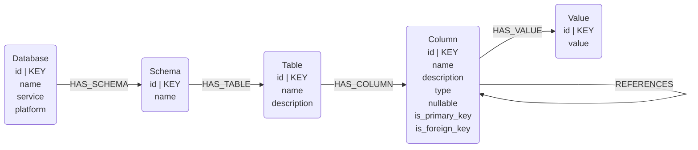
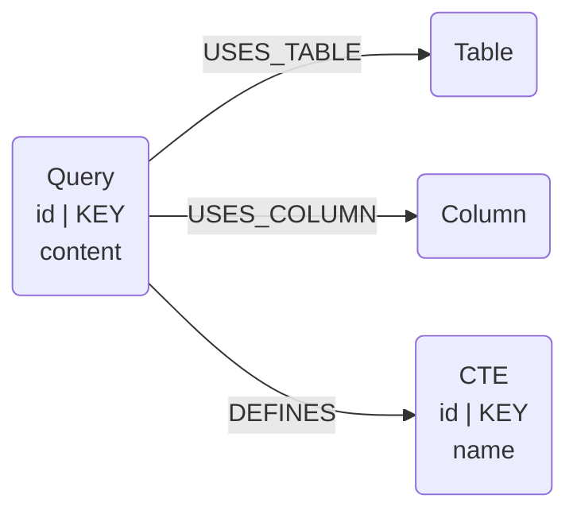

# BigQuery Connectors

## Overview

Reads BigQuery metadata directly from BigQuery's APIs and loads it into the Neocarta semantic graph. Two purpose-scoped sub-connectors:

- `BigQuerySchemaConnector` — catalog metadata for a dataset (databases, schemas, tables, columns, foreign-key references, and unique-value samples).
- `BigQueryLogsConnector` — query logs from `INFORMATION_SCHEMA.JOBS_BY_PROJECT`, producing Query / CTE nodes plus the tables and columns each query touches.

## Connector type

Source connector (ingest only). Sub-connectors layout:

- `bigquery/schema/` — schema sub-connector
- `bigquery/logs/` — query-log sub-connector

## Data model

### Schema sub-connector



### Query-log sub-connector



## Usage

### Schema

```python
import os
from google.cloud import bigquery
from neo4j import GraphDatabase
from neocarta.connectors.bigquery import BigQuerySchemaConnector

driver = GraphDatabase.driver(
    uri=os.getenv("NEO4J_URI"),
    auth=(os.getenv("NEO4J_USERNAME"), os.getenv("NEO4J_PASSWORD")),
)

connector = BigQuerySchemaConnector(
    client=bigquery.Client(project=os.getenv("GCP_PROJECT_ID")),
    project_id=os.getenv("GCP_PROJECT_ID"),
    neo4j_driver=driver,
    database_name=os.getenv("NEO4J_DATABASE", "neo4j"),
)
connector.ingest(dataset_id=os.getenv("BIGQUERY_DATASET_ID"))
```

### Query logs

```python
from neocarta.connectors.bigquery import BigQueryLogsConnector

connector = BigQueryLogsConnector(
    client=bigquery.Client(project=os.getenv("GCP_PROJECT_ID")),
    project_id=os.getenv("GCP_PROJECT_ID"),
    neo4j_driver=driver,
    database_name=os.getenv("NEO4J_DATABASE", "neo4j"),
)
connector.ingest(
    dataset_id=os.getenv("BIGQUERY_DATASET_ID"),
    region="region-us",
    limit=500,
)
```

### Environment variables

* `NEO4J_URI`, `NEO4J_USERNAME`, `NEO4J_PASSWORD`, `NEO4J_DATABASE` — Neo4j connection.
* `GCP_PROJECT_ID` — GCP project. Falls back to `client.project` if omitted.
* `BIGQUERY_DATASET_ID` — passed to `.ingest(dataset_id=...)`.

GCP credentials are picked up via Application Default Credentials (ADC) the same way the `google-cloud-bigquery` client picks them up.

## Source-specific setup

The BigQuery client uses ADC. Locally, run `gcloud auth application-default login`; on GCP, the workload identity / service account attached to the runtime is used automatically. The query-log connector additionally requires read access to `INFORMATION_SCHEMA.JOBS_BY_PROJECT` in the target region.

## Known issues

- Passing `dataset_id` to `BigQuerySchemaConnector.__init__` is deprecated. Pass it to `.ingest(dataset_id=...)` instead.
