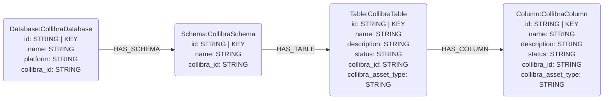
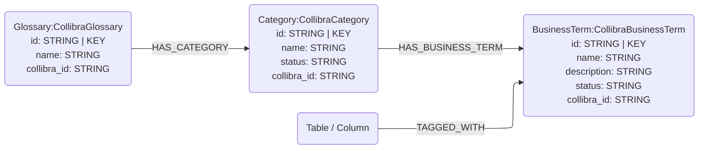

# Collibra Data Catalog Connector

## Overview

This connector reads metadata from [Collibra Data Intelligence Cloud](https://www.collibra.com/) via the Core REST API v2 and loads it into Neo4j following the neocarta graph data model. It maps Collibra's `Community → Domain → Asset` hierarchy onto the structural and semantic node types defined in this library. Every node it produces carries its source Collibra UUID in a `collibra_id` property and a Collibra-specific secondary label (e.g. `:Table:CollibraTable`), so a re-sync can recognise nodes neocarta sourced from Collibra without disturbing nodes from other connectors.

## Connector type

**Source** connector (ingest only). It provides two data-type sub-connectors over the same REST API:

| Sub-connector | Class | Produces |
|---|---|---|
| `schema/` | `CollibraSchemaConnector` | physical layer: Database, Schema, Table, Column |
| `glossary/` | `CollibraGlossaryConnector` | business glossary: Glossary, Category, BusinessTerm, and `TAGGED_WITH` tags |

Run the schema sub-connector first when you want `TAGGED_WITH` edges: the glossary connector matches the tagged Table/Column by `collibra_id`, so those nodes should already exist.

## Data model

Collibra nodes are written as subclasses of the core node types, sharing the core label plus a `Collibra*` secondary label. The mermaid below shows the core labels; each also carries the matching `Collibra*` label and a `collibra_id` property.

### Physical layer (`CollibraSchemaConnector`)



| Collibra entity | neocarta node |
|---|---|
| Community | `Database` (`CollibraDatabase`) |
| Domain (Physical Data Dictionary / Physical Data Model / Data Asset Catalog) | `Schema` (`CollibraSchema`) |
| Asset type = Table / Data Set / Database View / View | `Table` (`CollibraTable`) |
| Asset type = Column / Field / Report Attribute | `Column` (`CollibraColumn`) |

Columns are attached to their parent table using the Collibra "Table contains Column" relation, which also supplies the table segment of each column's deterministic id.

### Business glossary (`CollibraGlossaryConnector`)



| Collibra entity | neocarta node |
|---|---|
| Domain (Business Glossary / Business Terminology / Policy Glossary / Reference Data) | `Glossary` (`CollibraGlossary`) |
| Asset type = Data Category / Data Domain / Sub Domain | `Category` (`CollibraCategory`) |
| Asset type = Business Term | `BusinessTerm` (`CollibraBusinessTerm`) |

`TAGGED_WITH` edges are built from Collibra "associated with business term" relations. The tagged asset is matched by `collibra_id` (backed by a per-label range index), so a column ingested by the schema connector can be tagged by the glossary connector without recomputing its id.

## Usage

```python
import os
from neo4j import GraphDatabase
from neocarta.connectors.collibra import (
    CollibraClient,
    CollibraGlossaryConnector,
    CollibraSchemaConnector,
)

# The client holds the long-lived URL + credentials.
client = CollibraClient(
    base_url=os.environ["COLLIBRA_URL"],
    token=os.environ["COLLIBRA_TOKEN"],   # or username=... , password=...
)

with GraphDatabase.driver(
    os.environ["NEO4J_URI"],
    auth=(os.environ["NEO4J_USERNAME"], os.environ["NEO4J_PASSWORD"]),
) as driver:
    # Schema first, then glossary (so TAGGED_WITH resolves against Table/Column nodes).
    CollibraSchemaConnector(client=client, neo4j_driver=driver).ingest()
    CollibraGlossaryConnector(client=client, neo4j_driver=driver).ingest()
```

### Per-call scope and filtering

Scope inputs and graph-type filters are passed to `.ingest()` / `.extract()`:

```python
CollibraSchemaConnector(client=client, neo4j_driver=driver).ingest(
    community_ids=["<uuid-1>"],          # restrict to these communities
    domain_ids=["<uuid-2>"],             # restrict to these domains
    asset_type_names=["Table", "Column"],  # restrict to these Collibra asset types
    include_nodes=[NodeLabel.TABLE, NodeLabel.COLUMN],
    include_relationships=[RelationshipType.HAS_COLUMN],
)
```

`include_nodes` / `include_relationships` take values from `neocarta.enums.NodeLabel` / `RelationshipType`:

| Sub-connector | `include_nodes` | `include_relationships` |
|---|---|---|
| schema | `DATABASE`, `SCHEMA`, `TABLE`, `COLUMN` | `HAS_SCHEMA`, `HAS_TABLE`, `HAS_COLUMN` |
| glossary | `GLOSSARY`, `CATEGORY`, `BUSINESS_TERM` | `HAS_CATEGORY`, `HAS_BUSINESS_TERM`, `TAGGED_WITH` |

### Environment variables

| Variable | Required | Description |
|---|---|---|
| `COLLIBRA_URL` | Yes | Root URL, e.g. `https://myorg.collibra.com` |
| `COLLIBRA_TOKEN` | One of | JWT / OAuth bearer token (production auth) |
| `COLLIBRA_USERNAME` / `COLLIBRA_PASSWORD` | One of | Basic-auth credentials |
| `NEO4J_URI`, `NEO4J_USERNAME`, `NEO4J_PASSWORD` | Yes | Neo4j connection |
| `NEO4J_DATABASE` | No | Neo4j database name (default `neo4j`) |

## Source-specific setup

- **Authentication** — pass exactly one of: a bearer `token` (JWT or OAuth client-credentials access token), or `username` + `password`. Basic auth establishes a session via `POST /rest/2.0/auth/sessions` and reuses the session cookie.
- **API endpoints used** — `/rest/2.0/{assetTypes,domainTypes,relationTypes}` (type discovery), `/rest/2.0/communities`, `/rest/2.0/domains`, `/rest/2.0/assets`, `/rest/2.0/attributes` (per asset, single `assetId`), `/rest/2.0/relations` (by `relationTypeId`).
- **Type mapping** — Collibra type display names are customer-configurable; the alias tables in `type_mapping.py` cover the standard operating model. Override-by-instance can be added there.

## Known issues / limitations

- **Technical lineage is not yet produced.** Collibra materialises lineage as relations of specific lineage relation types; deriving `FLOWS_INTO` from those is deferred to a follow-up.
- **First-class non-schema/glossary asset types are not modelled.** Asset types outside each sub-connector's scope (Report, Data Quality Rule, Policy, Data Source, …) are skipped and reported once via `UnmappedCollibraAssetTypeWarning` rather than coerced into an ill-fitting node; mapping them is deferred to follow-ups.
- **Columns whose parent table is out of scope are skipped**, since a stable column id (`database.schema.table.column`) requires its table. This happens when scoping captures a column but not its table, the "Table contains Column" relation is missing, or the parent failed type classification. Skipped columns are reported via `UnresolvedCollibraParentWarning` (so to capture all columns, extract their tables too).
