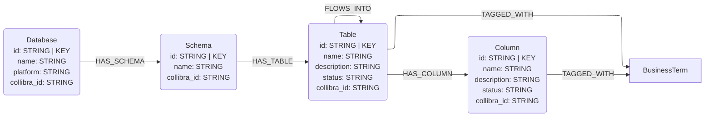
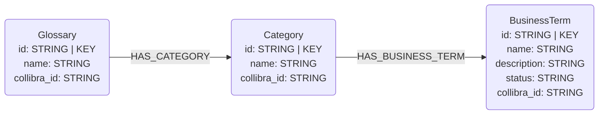

# Collibra Data Catalog Connector

## Overview

This connector reads metadata from the [Collibra Data Catalog](https://www.collibra.com/product/data-catalog/) REST API and loads it into Neo4j following the neocarta graph data model. It maps Collibra's three-level hierarchy (Communities → Domains → Assets) to the structural and semantic node types defined in this library.

## Data Model

### Structural metadata (physical data layer)



Collibra mapping:

| Collibra entity | Neocarta node |
|---|---|
| Community | `Database` |
| Domain (Physical Data Dictionary type) | `Schema` |
| Asset type = Table / Data Set / Report / View | `Table` |
| Asset type = Column / Field / Report Attribute | `Column` |

### Semantic metadata (business glossary layer)



Collibra mapping:

| Collibra entity | Neocarta node |
|---|---|
| Domain (Business Glossary type) | `Glossary` |
| Asset type = Data Domain / Sub Domain | `Category` |
| Asset type = Business Term | `BusinessTerm` |

### Unknown / custom asset types

Asset types not covered by the mappings above produce a generic `CatalogAsset` node connected to its parent domain via a `HAS_ASSET` relationship. The original Collibra asset type name is stored in the `asset_type` property.

### Technical lineage

When `include_lineage=True` (the default), the connector calls the Catalog Technical Lineage API (`GET /rest/catalog/1.0/asset/{id}/outboundLineage`) for each Table and Column asset and creates `FLOWS_INTO` relationships between the source and target nodes.

## Authentication

Two modes are supported — pass exactly one:

| Mode | Parameters |
|---|---|
| Bearer token (recommended for production) | `token="<jwt>"` |
| Basic auth (username + password) | `username="..."`, `password="..."` |

Basic auth calls `POST /rest/2.0/auth/sessions` on first use and reuses the resulting session cookie for all subsequent requests.

## Usage

### Minimal example

```python
import os
from neo4j import GraphDatabase
from neocarta.connectors.collibra import CollibraConnector

with GraphDatabase.driver(
    os.environ["NEO4J_URI"],
    auth=(os.environ["NEO4J_USERNAME"], os.environ["NEO4J_PASSWORD"]),
) as driver:
    connector = CollibraConnector(
        collibra_url=os.environ["COLLIBRA_URL"],
        neo4j_driver=driver,
        token=os.environ["COLLIBRA_TOKEN"],   # or username= / password=
    )
    connector.run()
```

### Scoped extraction

Restrict extraction to specific communities, domains, or asset types to reduce API calls and graph size:

```python
connector = CollibraConnector(
    collibra_url=os.environ["COLLIBRA_URL"],
    neo4j_driver=driver,
    token=os.environ["COLLIBRA_TOKEN"],
    community_ids=["<uuid-1>", "<uuid-2>"],   # restrict to these communities
    domain_ids=["<uuid-3>"],                   # restrict to these domains
    asset_type_names=["Table", "Column", "Business Term"],
    include_lineage=False,                     # skip lineage for faster runs
)
connector.run()
```

### Step-by-step ETL

```python
connector = CollibraConnector(...)

connector.extract_metadata()          # pulls DataFrames from Collibra REST API
connector.transform_metadata()        # converts DataFrames to neocarta model objects
connector.load_metadata(overwrite_existing=True)  # writes to Neo4j
```

## Environment Variables

| Variable | Required | Description |
|---|---|---|
| `COLLIBRA_URL` | Yes | Root URL, e.g. `https://myorg.collibra.com` |
| `COLLIBRA_TOKEN` | One of | JWT Bearer token (production auth) |
| `COLLIBRA_USERNAME` | One of | Collibra username (basic auth) |
| `COLLIBRA_PASSWORD` | With username | Collibra password (basic auth) |
| `NEO4J_URI` | Yes | Neo4j bolt URI, e.g. `neo4j+s://xxx.databases.neo4j.io` |
| `NEO4J_USERNAME` | Yes | Neo4j username |
| `NEO4J_PASSWORD` | Yes | Neo4j password |
| `NEO4J_DATABASE` | No | Neo4j database name (default: `neo4j`) |

Optional scope filters (comma-separated UUID lists):

| Variable | Description |
|---|---|
| `COLLIBRA_COMMUNITY_IDS` | Restrict extraction to these community UUIDs |
| `COLLIBRA_DOMAIN_IDS` | Restrict extraction to these domain UUIDs |

## Connector Components

| Class | Module | Responsibility |
|---|---|---|
| `CollibraClient` | `client.py` | HTTP client with auth, pagination, and 429 retry |
| `CollibraExtractor` | `extract.py` | Calls REST API and returns DataFrames |
| `CollibraTransformer` | `transform.py` | Maps DataFrames to neocarta model objects |
| `CollibraConnector` | `connector.py` | Orchestrates extract → transform → load |

## API Endpoints Used

| Endpoint | Purpose |
|---|---|
| `POST /rest/2.0/auth/sessions` | Basic auth session establishment |
| `GET /rest/2.0/assetTypes` | Type UUID discovery |
| `GET /rest/2.0/domainTypes` | Type UUID discovery |
| `GET /rest/2.0/relationTypes` | Type UUID discovery |
| `GET /rest/2.0/communities` | Community extraction |
| `GET /rest/2.0/domains` | Domain extraction |
| `GET /rest/2.0/assets` | Asset extraction |
| `GET /rest/2.0/attributes` | Attribute extraction (batched, ≤100 IDs per request) |
| `GET /rest/2.0/relations` | Relation extraction |
| `GET /rest/catalog/1.0/asset/{id}/outboundLineage` | Technical lineage (optional) |
