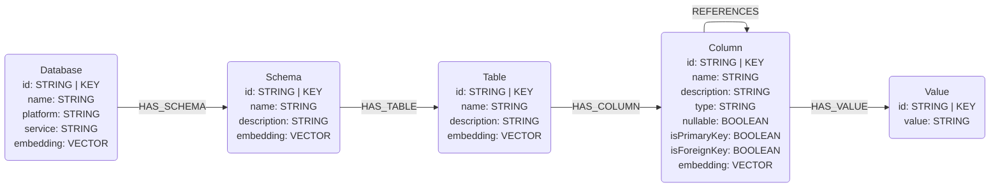
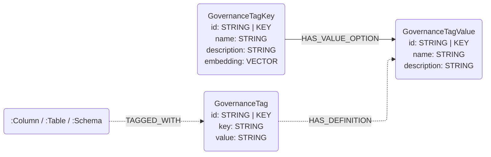

# Databricks Connector

## Overview

This connector reads metadata from **managed Databricks** Unity Catalog into this
library's graph data model. It provides three sub-connectors:

- **Schema** — structural metadata (`Database` / `Schema` / `Table` / `Column` /
  `Value` and the `HAS_*` / `REFERENCES` edges) read from a catalog's
  [`information_schema`](https://docs.databricks.com/aws/en/sql/language-manual/information-schema/)
  views over a **Databricks SQL warehouse**, using the official
  [`databricks-sql-connector`](https://pypi.org/project/databricks-sql-connector/)
  (a pure-Python DB-API 2.0 client). **No Spark, no JDBC, no cluster** — the
  extractor issues plain `SELECT ... FROM <catalog>.information_schema.*` queries
  and pulls the results into pandas, mirroring the BigQuery schema connector. This
  is the lightweight in-process path for users who have a SQL warehouse but no
  Spark runtime.
- **Metrics** — Unity Catalog **metric views** (Business Semantics) mapped onto
  the OSI semantic-model nodes (`OsiSemanticModel` / `OsiTable` / `OsiColumn` /
  `Metric` / `Expression` / `OsiAiContext`). Uses the same SQL-warehouse transport
  as the schema sub-connector — **no Spark**. See
  [`metrics/README.md`](metrics/README.md).
- **Governance tags** — governed-tag *definitions* mapped into the vendor-neutral
  governance-tag layer (`GovernanceTagKey` / `GovernanceTagValue`), read through
  the Databricks SDK (`WorkspaceClient.tag_policies`) — **no SQL warehouse
  required**.

This is distinct from the [`unity_catalog`](../unity_catalog/) connector, which
speaks the vendor-neutral **open-source** Unity Catalog REST API (no managed
Databricks features, no key/constraint metadata). Both Databricks sub-connectors
live behind the optional `databricks` extra:

```bash
pip install neocarta[databricks]
```

A Spark-based schema connector (using Spark SQL and the Neo4j Spark Connector)
remains a separate, future option and would ship under its own extra so this
warehouse-only package never pulls Spark.

## Connector type

Source connector (ingest only). It provides three data-type sub-connectors:

- `DatabricksSchemaConnector` — Unity Catalog `information_schema` →
  `Database` / `Schema` / `Table` / `Column` / `Value`.
- `DatabricksMetricsConnector` — Unity Catalog metric views →
  `OsiSemanticModel` / `OsiTable` / `OsiColumn` / `Metric` / `Expression` /
  `OsiAiContext`.
- `DatabricksTagsConnector` — governed-tag definitions → `GovernanceTagKey` /
  `GovernanceTagValue`.

---

# Schema sub-connector

## Data model

Maps Unity Catalog onto the **core** RDBMS data model
(`neocarta.data_model.schema.rdbms`): a catalog → `Database`, a schema →
`Schema`, tables and views → `Table`, columns → `Column`, and sampled distinct
values → `Value`. Declared primary/foreign keys set the column key flags and
produce `REFERENCES` edges.



`Database` nodes carry `platform="DATABRICKS"` and `service="UNITY_CATALOG"`
(matching the `unity_catalog` connector, so the same catalog merges to a
consistent node regardless of which path loaded it).

## Usage

```python
import os
from databricks import sql
from neo4j import GraphDatabase
from neocarta.connectors.databricks import DatabricksSchemaConnector

neo4j_driver = GraphDatabase.driver(
    uri=os.getenv("NEO4J_URI"),
    auth=(os.getenv("NEO4J_USERNAME"), os.getenv("NEO4J_PASSWORD")),
)

# The caller builds and owns the connection (mirroring how the BigQuery
# connector takes a client); the connector never closes it.
connection = sql.connect(
    server_hostname=os.getenv("DATABRICKS_SERVER_HOSTNAME"),
    http_path=os.getenv("DATABRICKS_HTTP_PATH"),  # SQL warehouse HTTP path
    access_token=os.getenv("DATABRICKS_TOKEN"),   # personal access token (PAT)
)

connector = DatabricksSchemaConnector(
    connection=connection,
    catalog=os.getenv("DATABRICKS_CATALOG"),       # analog of BigQuery project_id
    neo4j_driver=neo4j_driver,
    database_name=os.getenv("NEO4J_DATABASE", "neo4j"),
)
connector.ingest(schema=os.getenv("DATABRICKS_SCHEMA"))  # one schema per call

connection.close()  # the caller owns the connection's lifecycle
```

Pass `value_sample_limit=0` to skip value sampling entirely (see *Known issues*).

### Environment variables

The connector reads no environment variables itself — build the connection and
Neo4j driver from your own config (the example reads them from the environment).

* `NEO4J_URI`, `NEO4J_USERNAME`, `NEO4J_PASSWORD`, `NEO4J_DATABASE` — Neo4j connection.
* `DATABRICKS_SERVER_HOSTNAME` — workspace host, e.g. `dbc-xxxx.cloud.databricks.com`.
* `DATABRICKS_HTTP_PATH` — the SQL warehouse HTTP path, e.g. `/sql/1.0/warehouses/abc123`.
* `DATABRICKS_TOKEN` — personal access token (PAT). OAuth M2M (service principal)
  is a documented follow-up.
* `DATABRICKS_CATALOG`, `DATABRICKS_SCHEMA` — the catalog (Database) and the
  schema to ingest.

### `INFORMATION_SCHEMA` views read

All scoped to `<catalog>.information_schema.*`:

| Stage | View(s) |
|---|---|
| schema info | `schemata` |
| table info | `tables` (base tables + views) |
| column info | `columns`, plus `table_constraints` + `key_column_usage` for PK/FK flags |
| references | `referential_constraints` + `key_column_usage` (FK → referenced PK) |
| value samples | `SELECT slice(collect_set(col), 1, n)` per groupable column |

### Filtering options

There is no `include_nodes` / `include_relationships` filtering in this version
(matching the BigQuery schema connector); `ingest(schema=...)` produces the full
graph shape above. The one knob is `value_sample_limit` (a data-read cost/PII
control, not a graph-entity filter).

## Source-specific setup

1. A running **SQL warehouse** (not an all-purpose cluster); obtain its
   `server_hostname` and `http_path` from the warehouse's *Connection details*.
2. A personal access token (PAT) that can read the target catalog's
   `information_schema` (and the table data, if value sampling is enabled).
3. Build the `databricks.sql` connection and pass it to the connector.

## Known issues / limitations

- **PAT auth only (v1).** OAuth M2M / service-principal auth is a documented
  follow-up. Note that `databricks.sql.connect(...)` validates the token
  **eagerly**, so an invalid PAT raises at connection construction (in your code,
  before the connector runs) rather than as a connector error — the connector
  receives an already-open, caller-owned connection.
- **One schema per call.** `ingest(schema=...)` ingests a single schema, like the
  BigQuery connector's per-dataset model; loop over schemas to ingest several.
- **Value sampling reads table data.** It is on by default (`value_sample_limit=10`)
  and is the only stage that reads actual table *data* rather than
  `information_schema` — it incurs warehouse compute, needs data-read grants beyond
  the catalog metadata, and can surface PII. Pass `value_sample_limit=0` to skip it
  (no `:Value` nodes / `HAS_VALUE` edges). Complex/non-groupable column types
  (ARRAY/MAP/STRUCT/BINARY/VARIANT) are skipped automatically.
- **Keys are informational.** Unity Catalog primary/foreign keys are *not enforced*
  and appear only when tables declare constraints; without declared keys, column
  key flags stay `False` and no `REFERENCES` edges are produced. Inferred-FK
  discovery is out of scope.
- **Missing schema fails fast.** If `information_schema.schemata` returns no row for
  the requested schema (a typo, or the warehouse can't see it), the connector raises
  a `ConfigError` rather than synthesizing an empty schema — a config problem surfaces
  as a failure, not a silent partial graph.
- **Cross-schema/catalog foreign keys.** A `REFERENCES` edge uses the foreign key's
  own catalog/schema for the source column and the *referenced* table's catalog/schema
  for the target, so a foreign key pointing at a table in another schema resolves
  correctly. (Unity Catalog foreign keys are informational and usually intra-schema.)
- **Pass a regular catalog, not `system`.** Every query is scoped to the catalog
  you pass (`WHERE table_catalog = <catalog>`), so a normal catalog's per-catalog
  `information_schema` is read as expected. The special `system` catalog exposes an
  *account-wide* `information_schema` spanning all catalogs; the catalog filter
  keeps ingestion correctly scoped to `system`'s own objects, but it is not a
  meaningful ingestion target for your data.
- **Some shared/Delta-Sharing catalogs omit column metadata.** Databricks does not
  always populate `information_schema.columns` for managed sample / Delta-Sharing
  catalogs (e.g. `samples.tpcds_sf1` lists tables but no columns). The connector
  faithfully reflects what `information_schema` returns, so such schemas yield
  `Table` nodes with no `Column` nodes. Ingest a regular Unity Catalog catalog for
  full column metadata.

---

# Governance-tags sub-connector

Reads governed-tag *definitions* (tag policies) via the Databricks SDK
(`WorkspaceClient.tag_policies`) — **no SQL warehouse and no cluster required**,
only a workspace host and token. Governed tags are account-level controlled
vocabularies (a tag *key* with an optional description and a list of allowed
*values*, e.g. `sensitivity ∈ {public, internal, pii}`).

Governance tags are modelled in their own right rather than as a business
glossary: a tag's values are controls/classifications, not business *terms*
(`sensitivity={pii, non_pii}` is not vocabulary). The governance-tag model is
shared across vendors — Snowflake object tags and GCP resource Tags fit the same
two-layer shape.

## Data model

The governance-tag model has two layers. This connector emits the **definition**
layer; the instance/assignment layer is a planned follow-up (see limitations).

- each governed tag **key** → a `GovernanceTagKey`, carrying the tag's
  description (the agent-searchable surface — a full-text index covers its name
  and description; `--embeddings` adds a vector index, embedding only those keys
  that have a description, since Databricks tag descriptions are optional);
- each allowed **value** → a `GovernanceTagValue` (name only — Databricks allowed
  values have no per-value description, and none is synthesized);
- each (key, value) pair → a `HAS_VALUE_OPTION` edge.

Node ids are namespaced by a `source` (the workspace's metastore id, or the host
as a fallback) so keys/values don't collide across accounts or vendors.



## Usage

```python
import os
from databricks.sdk import WorkspaceClient
from neo4j import GraphDatabase
from neocarta.connectors.databricks import DatabricksTagsConnector

neo4j_driver = GraphDatabase.driver(
    uri=os.getenv("NEO4J_URI"),
    auth=(os.getenv("NEO4J_USERNAME"), os.getenv("NEO4J_PASSWORD")),
)

workspace_client = WorkspaceClient(
    host=os.getenv("DATABRICKS_HOST"),
    token=os.getenv("DATABRICKS_TOKEN"),
)

connector = DatabricksTagsConnector(
    workspace_client=workspace_client,
    neo4j_driver=neo4j_driver,
    database_name=os.getenv("NEO4J_DATABASE", "neo4j"),
)
connector.ingest()  # include_system_tags=True to also pull platform tags (system./class./ai./sap.)
```

### Environment variables

The connector reads no environment variables itself — build the `WorkspaceClient`
and Neo4j driver from your own config (the example reads them from the
environment). The Databricks SDK also natively honors `DATABRICKS_HOST` /
`DATABRICKS_TOKEN` (and the other [unified-auth](https://docs.databricks.com/en/dev-tools/auth/index.html)
variables) when `WorkspaceClient()` is built with no arguments.

* `NEO4J_URI`, `NEO4J_USERNAME`, `NEO4J_PASSWORD`, `NEO4J_DATABASE` — Neo4j connection.
* `DATABRICKS_HOST` — workspace URL, e.g. `https://dbc-xxxx.cloud.databricks.com`.
* `DATABRICKS_TOKEN` — personal access token (or use another SDK auth method).

### Filtering options

There is no `include_nodes` / `include_relationships` filtering: the connector
always produces the single graph shape above. What it *does* offer is
platform-tag filtering, a choice about *which definitions to read* (not a
graph-entity filter):

- **`system_prefixes`** (CLI `--system-prefixes`) — tag-key prefixes treated as
  platform/partner-managed and excluded by default. The default set is
  `("system.", "class.", "ai.", "sap.")`: Databricks and partners auto-apply tags
  under these namespaces (`class.*` data classification, `ai.*` on `system.ai`
  models, `sap.*` Delta Sharing governance), which would otherwise swamp a user's
  own governance vocabulary. Override it to widen/narrow the set, or pass an empty
  value to disable prefix filtering.
- **`include_system_tags`** (CLI `--include-system-tags`, default `False`) — when
  `True`, ingest **everything**, ignoring `system_prefixes` entirely.

## Source-specific setup

1. Governed tags must be enabled and defined in your Databricks account
   (`CREATE GOVERNED TAG ...`), and the token must be able to read tag policies.
2. Obtain a workspace host URL and a personal access token (or configure another
   Databricks SDK auth method) and build a `WorkspaceClient`.
3. Optionally pass `source=...` to pin the id namespace (useful when the
   workspace has no readable metastore assignment).

## Known issues / limitations

- **Definitions only — no `TAGGED_WITH` edges yet.** The connector reads
  governed-tag *definitions*, not *assignments*, so tag keys/values are not yet
  linked to the `Column` / `Table` / `Schema` they tag. Assignment ingestion
  (from `information_schema.{catalog,schema,table,column}_tags`, which requires a
  SQL warehouse) is the instance layer of the governance model and a planned
  follow-up: it adds `GovernanceTag` instance nodes, `(:Column|:Table|:Schema)-[:TAGGED_WITH]->(:GovernanceTag)`
  edges, and `(:GovernanceTag)-[:HAS_DEFINITION]->(:GovernanceTagValue)` links
  (a missing `HAS_DEFINITION` marks a free-form / undefined value).
- **No per-value descriptions.** Databricks allowed values carry no description,
  so `GovernanceTagValue.description` is left unwritten (not set to NULL). The
  field exists for platforms whose values do carry descriptions (GCP resource
  Tags).
- **Value-less governed tags** become a `GovernanceTagKey` with no
  `GovernanceTagValue` options.
- **Platform tags excluded by default.** Governed tags whose key matches one of
  the `system_prefixes` (default `system.` / `class.` / `ai.` / `sap.`) are
  auto-applied by the platform/partners, not user-authored, so they are skipped
  unless `include_system_tags=True`. A workspace with only platform tags therefore
  ingests nothing by default — widen/narrow `--system-prefixes` to taste.
- **Account-scoped ids.** Governed tags are account-scoped; the connector
  namespaces ids by the metastore id (`source`). A tag used across multiple
  metastores/workspaces may appear under more than one namespace if ingested from
  each.
- **Case/separator-sensitive keys (values are safe).** `GovernanceTagValue` ids
  hash the value segment (md5, like the shared `generate_value_id`), so allowed
  values that differ only in case or separator (`High Risk` / `high-risk` /
  `high_risk`, or `PII` vs `pii`) stay **distinct** nodes — the original value is
  preserved on the node's `name`, only the id is hashed. `GovernanceTagKey` ids,
  however, normalize the key (lowercased, spaces/hyphens → underscores) like the
  other `generate_id` helpers, so two governed-tag **keys** that differ only in case
  or separator (`Cost Center` / `cost-center` / `cost_center`) still share one id and
  MERGE into a single node (first-loaded `name`/`description` wins). In practice
  governed-tag key sets are distinct slugs.
- **Dotted keys.** Ids join `source` and the key with `.` and that delimiter is not
  escaped, so a **key** containing `.` makes the key/value boundary ambiguous (e.g.
  key `sap.PersonalData` and the pair `sap` + value `PersonalData` could yield
  overlapping prefixes). The value segment is hashed, so value-side dot ambiguity is
  gone; relationship edges are unaffected (the loaders MATCH end nodes by explicit
  label), but a label-agnostic lookup by id could still conflate dotted keys. Dotted
  keys occur both as user-authored keys (e.g. `finance.cost_center`, ingested by
  default) and as the platform namespaces `system.`/`class.`/`ai.`/`sap.` (ingested
  only with `--include-system-tags` or a narrowed `--system-prefixes`).
