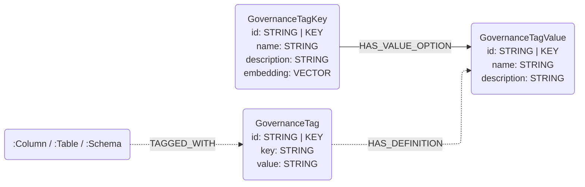

# Databricks Connector

## Overview

This connector reads **governance-tag** metadata from **managed Databricks**
Unity Catalog and maps it into the vendor-neutral governance-tag layer of this
library's graph data model. The first viable source is
[**governed tags**](https://docs.databricks.com/aws/en/admin/governed-tags/) —
account-level controlled vocabularies (a tag *key* with an optional description
and a list of allowed *values*, e.g. `sensitivity ∈ {public, internal, pii}`).
It reads governed-tag *definitions* through the Databricks SDK
(`WorkspaceClient.tag_policies`) — **no SQL warehouse and no cluster required**,
only a workspace host and token.

Governance tags are modelled in their own right rather than as a business
glossary: a tag's values are controls/classifications, not business *terms*
(`sensitivity={pii, non_pii}` is not vocabulary). The governance-tag model is
shared across vendors — Snowflake object tags and GCP resource Tags fit the same
two-layer shape — so this connector targets it instead of `Glossary` /
`Category` / `BusinessTerm`.

This is distinct from the [`unity_catalog`](../unity_catalog/) connector, which
speaks the vendor-neutral **open-source** Unity Catalog REST API (no governance
metadata). Governed tags are a managed-Databricks feature, so they live in this
separate `databricks` package, behind the optional `databricks` extra:

```bash
pip install neocarta[databricks]
```

## Connector type

Source connector (ingest only). It currently provides one data-type
sub-connector:

- `DatabricksTagsConnector` — governed-tag definitions → `GovernanceTagKey` /
  `GovernanceTagValue`.

A pyspark-based managed-Databricks **schema** sub-connector is planned and will
ship under this package in a separate extra (so this warehouse-free, SDK-only
tags connector never pulls Spark).

## Data model

The governance-tag model has two layers. This connector emits the **definition**
layer; the instance/assignment layer is a planned follow-up (see limitations).

- each governed tag **key** → a `GovernanceTagKey`, carrying the tag's
  description (the agent-searchable surface — a full-text index covers its name
  and description; `--embeddings` adds a vector index, embedding only those keys
  that have a description, since Databricks tag descriptions are optional);
- each allowed **value** → a `GovernanceTagValue` (name only — Databricks allowed
  values have no per-value description, and none is synthesized);
- each (key, value) pair → a `HAS_VALUE_OPTION` edge.

Node ids are namespaced by a `source` (the workspace's metastore id, or the host
as a fallback) so keys/values don't collide across accounts or vendors.



## Usage

```python
import os
from databricks.sdk import WorkspaceClient
from neo4j import GraphDatabase
from neocarta.connectors.databricks import DatabricksTagsConnector

neo4j_driver = GraphDatabase.driver(
    uri=os.getenv("NEO4J_URI"),
    auth=(os.getenv("NEO4J_USERNAME"), os.getenv("NEO4J_PASSWORD")),
)

workspace_client = WorkspaceClient(
    host=os.getenv("DATABRICKS_HOST"),
    token=os.getenv("DATABRICKS_TOKEN"),
)

connector = DatabricksTagsConnector(
    workspace_client=workspace_client,
    neo4j_driver=neo4j_driver,
    database_name=os.getenv("NEO4J_DATABASE", "neo4j"),
)
connector.ingest()  # include_system_tags=True to also pull platform tags (system./class./ai./sap.)
```

### Environment variables

The connector reads no environment variables itself — build the `WorkspaceClient`
and Neo4j driver from your own config (the example reads them from the
environment). The Databricks SDK also natively honors `DATABRICKS_HOST` /
`DATABRICKS_TOKEN` (and the other [unified-auth](https://docs.databricks.com/en/dev-tools/auth/index.html)
variables) when `WorkspaceClient()` is built with no arguments.

* `NEO4J_URI`, `NEO4J_USERNAME`, `NEO4J_PASSWORD`, `NEO4J_DATABASE` — Neo4j connection.
* `DATABRICKS_HOST` — workspace URL, e.g. `https://dbc-xxxx.cloud.databricks.com`.
* `DATABRICKS_TOKEN` — personal access token (or use another SDK auth method).

### Filtering options

There is no `include_nodes` / `include_relationships` filtering: the connector
always produces the single graph shape above. What it *does* offer is
platform-tag filtering, a choice about *which definitions to read* (not a
graph-entity filter):

- **`system_prefixes`** (CLI `--system-prefixes`) — tag-key prefixes treated as
  platform/partner-managed and excluded by default. The default set is
  `("system.", "class.", "ai.", "sap.")`: Databricks and partners auto-apply tags
  under these namespaces (`class.*` data classification, `ai.*` on `system.ai`
  models, `sap.*` Delta Sharing governance), which would otherwise swamp a user's
  own governance vocabulary. Override it to widen/narrow the set, or pass an empty
  value to disable prefix filtering.
- **`include_system_tags`** (CLI `--include-system-tags`, default `False`) — when
  `True`, ingest **everything**, ignoring `system_prefixes` entirely.

## Source-specific setup

1. Governed tags must be enabled and defined in your Databricks account
   (`CREATE GOVERNED TAG ...`), and the token must be able to read tag policies.
2. Obtain a workspace host URL and a personal access token (or configure another
   Databricks SDK auth method) and build a `WorkspaceClient`.
3. Optionally pass `source=...` to pin the id namespace (useful when the
   workspace has no readable metastore assignment).

## Known issues / limitations

- **Definitions only — no `TAGGED_WITH` edges yet.** The connector reads
  governed-tag *definitions*, not *assignments*, so tag keys/values are not yet
  linked to the `Column` / `Table` / `Schema` they tag. Assignment ingestion
  (from `information_schema.{catalog,schema,table,column}_tags`, which requires a
  SQL warehouse) is the instance layer of the governance model and a planned
  follow-up: it adds `GovernanceTag` instance nodes, `(:Column|:Table|:Schema)-[:TAGGED_WITH]->(:GovernanceTag)`
  edges, and `(:GovernanceTag)-[:HAS_DEFINITION]->(:GovernanceTagValue)` links
  (a missing `HAS_DEFINITION` marks a free-form / undefined value).
- **No per-value descriptions.** Databricks allowed values carry no description,
  so `GovernanceTagValue.description` is left unwritten (not set to NULL). The
  field exists for platforms whose values do carry descriptions (GCP resource
  Tags).
- **Value-less governed tags** become a `GovernanceTagKey` with no
  `GovernanceTagValue` options.
- **Platform tags excluded by default.** Governed tags whose key matches one of
  the `system_prefixes` (default `system.` / `class.` / `ai.` / `sap.`) are
  auto-applied by the platform/partners, not user-authored, so they are skipped
  unless `include_system_tags=True`. A workspace with only platform tags therefore
  ingests nothing by default — widen/narrow `--system-prefixes` to taste.
- **Account-scoped ids.** Governed tags are account-scoped; the connector
  namespaces ids by the metastore id (`source`). A tag used across multiple
  metastores/workspaces may appear under more than one namespace if ingested from
  each.
- **Case/separator-insensitive ids.** Node ids are normalized (lowercased, spaces
  and hyphens → underscores) by the shared `generate_id` helpers, but Databricks
  governed-tag keys and values are case-sensitive. Two governed-tag **keys** — or
  two allowed **values** of one key — that differ only in case or separator (e.g.
  `Cost Center` / `cost-center` / `cost_center`, or `High Risk` / `high-risk`)
  therefore share a `GovernanceTagKey` / `GovernanceTagValue` id and MERGE into a
  single node (the first-loaded `name`/`description` wins). This is an inherent
  property of the library's id scheme (the glossary ids behave the same); in
  practice governed-tag key and value sets are distinct slugs.
- **Dotted segments.** Ids join `source`, key, and value with `.` and that
  delimiter is not escaped, so a key or value that itself contains `.` makes the
  segment boundary ambiguous (e.g. key `sap.PersonalData` and the pair
  `sap` + value `PersonalData` both yield `….sap.personaldata`). Relationship
  edges are unaffected (the loaders MATCH end nodes by explicit label), and real
  governed-tag value sets rarely contain dots, but a label-agnostic lookup by id
  could conflate such nodes. Dotted **keys** occur both as user-authored keys (e.g.
  `finance.cost_center`, ingested by default) and as the platform namespaces
  `system.`/`class.`/`ai.`/`sap.` (ingested only with `--include-system-tags` or a
  narrowed `--system-prefixes`).
