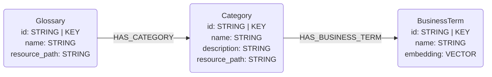

# Databricks Connector

## Overview

This connector reads **business-glossary** metadata from **managed Databricks**
Unity Catalog and maps it into the glossary layer of this library's graph data
model. The first viable source of business metadata in Databricks is
[**governed tags**](https://docs.databricks.com/aws/en/admin/governed-tags/) —
account-level controlled vocabularies (a tag *key* with an optional description
and a list of allowed *values*, e.g. `sensitivity ∈ {public, internal, pii}`).
It reads governed-tag *definitions* through the Databricks SDK
(`WorkspaceClient.tag_policies`) — **no SQL warehouse and no cluster required**,
only a workspace host and token.

This is distinct from the [`unity_catalog`](../unity_catalog/) connector, which
speaks the vendor-neutral **open-source** Unity Catalog REST API (no business
metadata). Governed tags are a managed-Databricks feature, so they live in this
separate `databricks` package, behind the optional `databricks` extra:

```bash
pip install neocarta[databricks]
```

## Connector type

Source connector (ingest only). It currently provides one data-type
sub-connector:

- `DatabricksGlossaryConnector` — governed-tag definitions → `Glossary` /
  `Category` / `BusinessTerm`.

A pyspark-based managed-Databricks **schema** sub-connector is planned and will
ship under this package in a separate extra (so this SQL-only glossary connector
never pulls Spark).

## Data model

A governed tag maps onto the three-level glossary hierarchy:

- one synthesized account/metastore-level `Glossary` (its id is the workspace's
  metastore id, or the host as a fallback);
- each governed tag **key** → a `Category`, carrying the tag's description and the
  tag policy id as `resource_path`;
- each allowed **value** → a `BusinessTerm` (name only — Databricks allowed
  values have no per-value description, and none is synthesized).



## Usage

```python
import os
from databricks.sdk import WorkspaceClient
from neo4j import GraphDatabase
from neocarta.connectors.databricks import DatabricksGlossaryConnector

neo4j_driver = GraphDatabase.driver(
    uri=os.getenv("NEO4J_URI"),
    auth=(os.getenv("NEO4J_USERNAME"), os.getenv("NEO4J_PASSWORD")),
)

workspace_client = WorkspaceClient(
    host=os.getenv("DATABRICKS_HOST"),
    token=os.getenv("DATABRICKS_TOKEN"),
)

connector = DatabricksGlossaryConnector(
    workspace_client=workspace_client,
    neo4j_driver=neo4j_driver,
    database_name=os.getenv("NEO4J_DATABASE", "neo4j"),
)
connector.ingest()  # include_system_tags=True to also pull system.* governed tags
```

### Environment variables

The connector reads no environment variables itself — build the `WorkspaceClient`
and Neo4j driver from your own config (the example reads them from the
environment). The Databricks SDK also natively honors `DATABRICKS_HOST` /
`DATABRICKS_TOKEN` (and the other [unified-auth](https://docs.databricks.com/en/dev-tools/auth/index.html)
variables) when `WorkspaceClient()` is built with no arguments.

* `NEO4J_URI`, `NEO4J_USERNAME`, `NEO4J_PASSWORD`, `NEO4J_DATABASE` — Neo4j connection.
* `DATABRICKS_HOST` — workspace URL, e.g. `https://dbc-xxxx.cloud.databricks.com`.
* `DATABRICKS_TOKEN` — personal access token (or use another SDK auth method).

### Filtering options

There is no `include_nodes` / `include_relationships` filtering in v1: the
connector always produces the single graph shape above. The bespoke
`include_system_tags` flag on `extract()` / `ingest()` controls whether
platform-managed `system.*` governed tags are pulled (default `False`); it is a
choice about *which definitions to read*, not a graph-entity filter.

## Source-specific setup

1. Governed tags must be enabled and defined in your Databricks account
   (`CREATE GOVERNED TAG ...`), and the token must be able to read tag policies.
2. Obtain a workspace host URL and a personal access token (or configure another
   Databricks SDK auth method) and build a `WorkspaceClient`.
3. Optionally pass `glossary_id=...` to pin the synthesized `Glossary` id (useful
   when the workspace has no readable metastore assignment).

## Known issues / limitations

- **Definitions only — no `TAGGED_WITH` edges (v1).** The connector reads
  governed-tag *definitions*, not *assignments*, so business terms are not yet
  linked to the `Column` / `Table` / `Schema` they tag. Assignment ingestion (from
  `information_schema.{catalog,schema,table,column}_tags`, which requires a SQL
  warehouse) is a planned follow-up behind an `include_assignments` flag; it is
  what powers the MCP business-term-bridged search.
- **No per-value descriptions.** Databricks allowed values carry no description,
  so `BusinessTerm.description` is left unwritten (not set to NULL). Run
  embeddings over `BusinessTerm` to add semantic search, or enrich descriptions
  later.
- **Value-less governed tags** become a `Category` with no `BusinessTerm`
  children.
- **System tags excluded by default.** Platform-managed `system.*` governed tags
  are skipped unless `include_system_tags=True`.
- **One account-level `Glossary`.** Governed tags are account-scoped; the
  connector synthesizes a single glossary keyed by the metastore id. A tag used
  across multiple metastores/workspaces may appear under more than one glossary if
  ingested from each.
- **Case/separator-insensitive ids.** Node ids are normalized (lowercased, spaces
  and hyphens → underscores) by the shared `generate_id` helpers, but Databricks
  governed-tag values are case-sensitive. Two allowed values that differ only in
  case or separator (e.g. `High Risk` / `high-risk` / `high_risk`) therefore share
  a `BusinessTerm` id and MERGE into a single node (the first-loaded `name` wins).
  This is an inherent property of the library's id scheme; in practice governed-tag
  value sets are distinct slugs.
