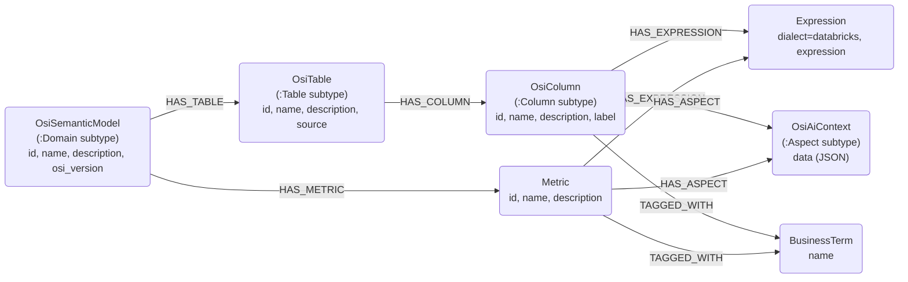

# Databricks Metrics Connector

## Overview

Reads **Databricks Unity Catalog metric views** ([Business Semantics](https://learn.microsoft.com/en-us/azure/databricks/business-semantics/metric-views/yaml-reference))
and maps them onto Neocarta's existing **OSI** semantic-model nodes. A metric
view *is* a small semantic model — a `source` plus measures and dimensions — so
its measures become `:Metric` nodes, its dimensions become semantic `:OsiColumn`
nodes, its SQL expressions become `:Expression` nodes, and its agent metadata
(synonyms / display names) becomes `:OsiAiContext` aspects, all grouped under an
`:OsiSemanticModel`. Only metadata crosses into Neo4j; the underlying data stays
in Databricks.

A metric view's definition is YAML stored as the view text, read over a
Databricks SQL warehouse via the in-process `databricks-sql-connector` (DB-API) —
no Spark, no JDBC.

## Connector type

Source connector (ingest only); provides: `DatabricksMetricsConnector`.

## Data model



| Metric view YAML | Graph |
|---|---|
| the metric view | `(:Domain:OsiSemanticModel)` — `name` = three-part UC path; `osi_version` = the metric-view YAML `version` |
| `measures[]` | `(:Metric)` via `(:Domain)-[:HAS_METRIC]->(:Metric)` (one per measure) |
| `fields[]` / `dimensions[]` | `(:Column:OsiColumn)` under `(:Table:OsiTable)` (`display_name`→`label`) |
| measure / field `expr` | `(:Expression {dialect:"databricks"})` via `HAS_EXPRESSION` |
| `synonyms` / `display_name` | `(:Aspect:OsiAiContext)` via `HAS_ASPECT`; `synonyms` also upsert `BusinessTerm` `TAGGED_WITH` edges |

The metric view is also recorded as an `(:Table:OsiTable)` whose `source` is the
three-part name, so its dimensions are first-class columns and the lineage
pointer is preserved.

## Usage

```python
import os

from databricks import sql
from neo4j import GraphDatabase

from neocarta.connectors.databricks import DatabricksMetricsConnector

neo4j_driver = GraphDatabase.driver(
    uri=os.getenv("NEO4J_URI"),
    auth=(os.getenv("NEO4J_USERNAME"), os.getenv("NEO4J_PASSWORD")),
)

# The caller owns the databricks.sql connection (and closes it).
with sql.connect(
    server_hostname=os.getenv("DATABRICKS_SERVER_HOSTNAME"),
    http_path=os.getenv("DATABRICKS_HTTP_PATH"),
    access_token=os.getenv("DATABRICKS_TOKEN"),
) as connection:
    connector = DatabricksMetricsConnector(
        connection=connection,
        catalog=os.getenv("DATABRICKS_CATALOG"),
        neo4j_driver=neo4j_driver,
    )
    connector.ingest(schema=os.getenv("DATABRICKS_SCHEMA"))
```

Generate embeddings afterwards (optional) with
`neocarta.enrichment.embeddings.LiteLLMEmbeddingsConnector` over
`NodeLabel.METRIC` / `NodeLabel.COLUMN` / `NodeLabel.TABLE` / `NodeLabel.DOMAIN`
to turn on semantic metric search.

### Environment variables

- `NEO4J_URI`, `NEO4J_USERNAME`, `NEO4J_PASSWORD` — Neo4j connection.
- `DATABRICKS_SERVER_HOSTNAME` — SQL warehouse host (e.g. `dbc-xxxx.cloud.databricks.com`).
- `DATABRICKS_HTTP_PATH` — SQL warehouse HTTP path (e.g. `/sql/1.0/warehouses/<id>`).
- `DATABRICKS_TOKEN` — personal access token (secret).
- `DATABRICKS_CATALOG`, `DATABRICKS_SCHEMA` — the catalog/schema to scan.

Requires the `databricks` extra: `pip install "neocarta[databricks]"`.

## Source-specific setup

The personal access token (or the principal behind any other
`databricks.sql`-supported auth) must be able to run the SQL warehouse and read
the catalog's `information_schema`. The connector reads metadata only — it never
queries metric-view data.

## How metric views are read

Validated against a live Databricks workspace:

- **Discovery** — metric views are a distinct object type: they appear in
  `<catalog>.information_schema.tables` with `table_type = 'METRIC_VIEW'`. (They
  are *not* regular views, so they do not appear in `information_schema.views`.)
- **Definition** — `DESCRIBE TABLE EXTENDED <view> AS JSON` returns a
  `json_metadata` payload whose `view_text` field is the metric view's raw YAML,
  which is parsed with `yaml.safe_load`. Both steps are isolated in `extract.py`
  (`_list_metric_views` / `_read_metric_view_yaml`).

## Known issues / limitations

- **ID normalization can collide on free-form names.** Node ids are normalized
  (lowercased, spaces/hyphens → `_`) by the shared `generate_id` helpers, so two
  measures/dimensions whose names differ only in case or separator (e.g.
  `Total Revenue` vs `total-revenue`) map to the same id and collapse to one node.
  The original name is preserved on the node; only the id collapses. This is
  shared behavior across all neocarta connectors, and rare for metric views (whose
  names are usually identifier-like).
- **No physical lineage (v1).** Metric measures/dimensions are not yet linked to
  the underlying physical `:Table`/`:Column` they derive from; `joins`, `filter`,
  `materialization`, `format`, and (Experimental) window measures are out of
  scope. The `OsiTable.source` string is preserved so this lineage can be
  resolved later (issue #210).
