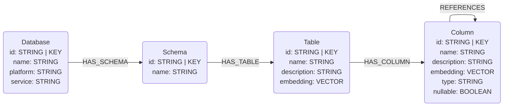
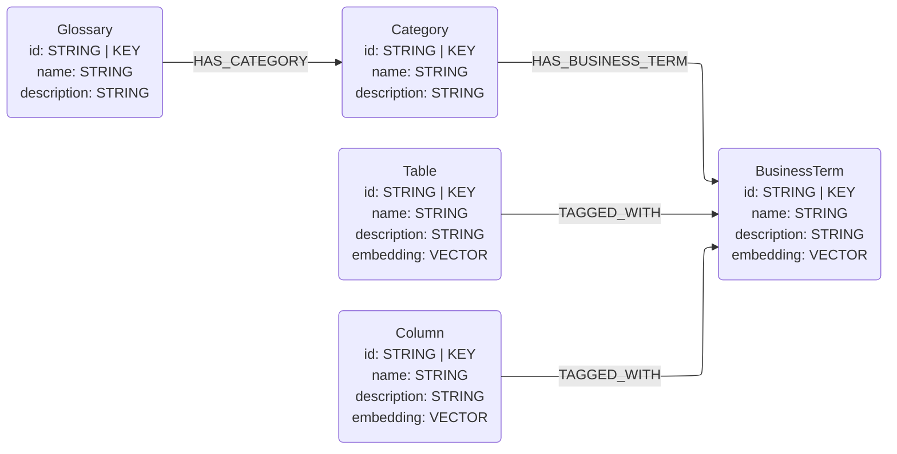
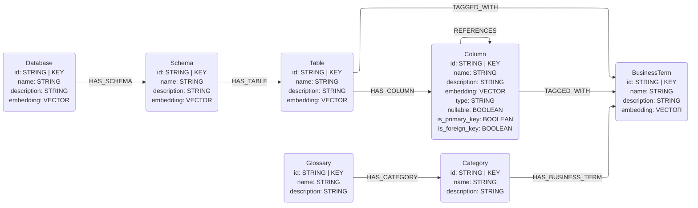

# GCP Dataplex Universal Catalog Connector

## Overview

This connector reads information from the GCP Dataplex Universal Catalog via the Python client and maps it to the graph data model schema defined in this library. 

Currently this connector supports reading BigQuery metadata stored in Dataplex and Glossary information.

## Data Models

### BigQuery Metadata

The BigQuery metadata available via Dataplex is not as comprehensive as reading the metadata directly from BigQuery. Below is the supported data model. Notably absent are the primary and foreign key identifiers. Each column is therefore loaded with `is_primary_key=False` and `is_foreign_key=False`.



### Glossary Information

Dataplex has a Glossary that allows us to store business terms. Terms may then be connected to columns and tables via the `projects.locations:lookupEntryLinks` REST API, which allows us to infer relationships via entities that share a common business term. Below is the supported data model.



## Known Issues

### Aspect handling

Information such as primary / foreign keys and data stewardship may be defined as Dataplex Aspects. Aspects are custom definitions and so automating the identification and mapping of Aspects to Steward nodes, for example, is difficult.

The full data model is shown below. Note that `Value` nodes are still absent in the Dataplex output.



## Usage

Dataplex is a source connector with two purpose-scoped sub-connectors:

- `DataplexSchemaConnector` — BigQuery catalog metadata (Database / Schema / Table / Column).
- `DataplexGlossaryConnector` — business glossary terms plus catalog↔glossary entry links that back `(:Column)-[:TAGGED_WITH]->(:BusinessTerm)` and `(:Table)-[:TAGGED_WITH]->(:BusinessTerm)` edges.

Ingest schema first so the glossary connector's TAGGED_WITH edges find their target Column / Table nodes. The glossary connector accepts `include_entry_links=False` to skip the REST-API round trips when the catalog is not in this Neo4j instance.

### Code Example

```python
import os
from neo4j import GraphDatabase
from google.cloud import dataplex_v1
from neocarta.connectors.dataplex import DataplexGlossaryConnector, DataplexSchemaConnector

neo4j_driver = GraphDatabase.driver(
    uri=os.getenv("NEO4J_URI"),
    auth=(os.getenv("NEO4J_USERNAME"), os.getenv("NEO4J_PASSWORD")),
)
neo4j_database = os.getenv("NEO4J_DATABASE", "neo4j")
catalog_client = dataplex_v1.CatalogServiceClient()
glossary_client = dataplex_v1.BusinessGlossaryServiceClient()

common = dict(
    project_id=os.getenv("GCP_PROJECT_ID"),
    project_number=os.getenv("GCP_PROJECT_NUMBER"),
    dataplex_location=os.getenv("DATAPLEX_LOCATION"),
    neo4j_driver=neo4j_driver,
    database_name=neo4j_database,
)

DataplexSchemaConnector(catalog_client=catalog_client, **common).ingest(
    dataset_id=os.getenv("BIGQUERY_DATASET_ID")
)

DataplexGlossaryConnector(glossary_client=glossary_client, **common).ingest(
    include_entry_links=True,
)
```

### Environment Variables

The following environment variables are required:

* `NEO4J_URI` - Neo4j database connection URI (e.g., `bolt://localhost:7687`)
* `NEO4J_USERNAME` - Neo4j username (default: `neo4j`)
* `NEO4J_PASSWORD` - Neo4j password
* `NEO4J_DATABASE` - Neo4j database name (default: `neo4j`)
* `GCP_PROJECT_ID` - Google Cloud project ID
* `GCP_PROJECT_NUMBER` - Google Cloud project number
* `DATAPLEX_LOCATION` - Dataplex location (e.g., `us-central1`)
* `BIGQUERY_DATASET_ID` - BigQuery dataset ID (passed to `DataplexSchemaConnector.ingest(dataset_id=...)`)

