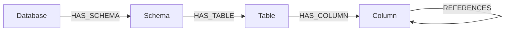

# JDBC connector

Extracts schema metadata from any JDBC-compatible database (PostgreSQL, MySQL,
Oracle, SQL Server, Redshift, …) and loads it into the neocarta semantic graph.
The Java↔Python bridge is a **subprocess** call to the
[SchemaCrawler](https://www.schemacrawler.com/) CLI: neocarta runs SchemaCrawler
with a bundled **FreeMarker template** that renders the catalog as compact JSON
(tables, columns, primary keys, and foreign keys), captures it on stdout, and
transforms it into graph nodes and relationships. This reuses a battle-tested
Java schema-extraction library that supports 20+ databases instead of
hand-rolling an extractor per dialect.

> **Why a template, not `--command=serialize`?** SchemaCrawler's `serialize`
> JSON output omits tables and foreign keys (verified on 16.27.1), so it cannot
> produce `REFERENCES`. SchemaCrawler's `template` command has full access to the
> catalog model, so the bundled [`schema/catalog.json.ftl`](schema/catalog.json.ftl)
> emits exactly the fields below — at the cost of one extra JAR (FreeMarker) on
> the classpath.

## Connector type

**Source connector** (ingest only). Today it ships a single data-type
sub-connector, `JdbcSchemaConnector` (`jdbc/schema/`), which extracts catalog
structure. A future query-log sub-connector would live alongside it at
`jdbc/logs/` (out of scope here — query-log extraction varies too much by
database).

## Data model



| Node / Relationship | Source | Notes |
| --- | --- | --- |
| `Database {id, name}` | parsed from the JDBC URL (or `source_database_name`) | one per ingest |
| `Schema {id, name, description}` | SchemaCrawler schema (`name`, `remarks`) | |
| `Table {id, name, description}` | SchemaCrawler table (`name`, `remarks`) | base tables |
| `Column {id, name, description, type, nullable, is_primary_key, is_foreign_key}` | SchemaCrawler column | flags from `partOfPrimaryKey` / `partOfForeignKey` |
| `(:Column)-[:REFERENCES]->(:Column)` | SchemaCrawler imported foreign keys | source FK column → referenced PK column |

SchemaCrawler reads **metadata only**, so this connector does not produce
`Value` nodes (sampled column values).

## Usage

```python
import os

from neo4j import GraphDatabase

from neocarta.connectors.jdbc import JdbcSchemaConnector

neo4j_driver = GraphDatabase.driver(
    os.getenv("NEO4J_URI"),
    auth=(os.getenv("NEO4J_USERNAME"), os.getenv("NEO4J_PASSWORD")),
)

connector = JdbcSchemaConnector(
    jdbc_url=os.getenv("JDBC_URL"),               # jdbc:postgresql://host:5432/mydb
    jdbc_driver=os.getenv("JDBC_DRIVER"),         # org.postgresql.Driver
    jdbc_driver_jar=os.getenv("JDBC_DRIVER_JAR"), # lib/postgresql-42.7.3.jar
    schemacrawler_jar=os.getenv("SCHEMACRAWLER_JAR"),  # …/_schemacrawler/lib/*
    neo4j_driver=neo4j_driver,
    database_name=os.getenv("NEO4J_DATABASE", "neo4j"),
    db_user=os.getenv("JDBC_USER"),
    db_password=os.getenv("JDBC_PASSWORD"),
)

# Restrict to specific schemas; omit `schemas` to extract all of them.
connector.ingest(schemas=["public", "analytics"])
```

### Environment variables

| Variable | Example | Purpose |
| --- | --- | --- |
| `JDBC_URL` | `jdbc:postgresql://localhost:5432/mydb` | connection URL |
| `JDBC_DRIVER` | `org.postgresql.Driver` | JDBC driver class |
| `JDBC_DRIVER_JAR` | `lib/postgresql-42.7.3.jar` | path to the JDBC driver JAR |
| `SCHEMACRAWLER_JAR` | `path/to/_schemacrawler/lib/*` | SchemaCrawler distribution `lib/*` classpath (**must include a FreeMarker JAR**) |
| `JDBC_USER` | `postgres` | database user (optional) |
| `JDBC_PASSWORD` | `secret` | database password (optional) |

### Filtering

`ingest(schemas=[...])` (forwarded to `extract`) scopes which schemas
SchemaCrawler reads. The names are combined into a regex alternation for
SchemaCrawler's `--schemas=<regex>`. Omit the argument to extract every schema.

The `db_password` is passed to SchemaCrawler through the environment
(`--password:env=`), never on the command line, so it does not appear in the
host process list.

### Source database name

The `Database` node name (and the root segment of every entity id) is parsed
from the JDBC URL's path component (e.g. `mydb` from
`jdbc:postgresql://host:5432/mydb`). For URL shapes without a path-based name —
Oracle SID URLs (`jdbc:oracle:thin:@host:1521:ORCL`) or SQL Server
(`jdbc:sqlserver://host;databaseName=mydb`) — pass `source_database_name=...`
explicitly.

## Source-specific setup

This connector requires tooling that **cannot** be installed from the Python
environment. The host running neocarta must provide:

1. **Java 11+.** The connector checks `java -version` at construction and raises
   a clear `ConfigError` if Java is missing. Install a JRE/JDK (e.g.
   [Temurin](https://adoptium.net/)) and ensure `java` is on `PATH`.
2. **The SchemaCrawler distribution.** Download a SchemaCrawler 16.x release from
   <https://www.schemacrawler.com/downloads.html> and unzip it. Point
   `SCHEMACRAWLER_JAR` at its `_schemacrawler/lib/*` directory — SchemaCrawler is
   a multi-JAR distribution, so the classpath uses the `lib/*` wildcard (Java
   expands it; it is passed literally, not shell-globbed), **not** a single
   "fat JAR".
3. **A FreeMarker JAR** on that classpath. The connector renders its catalog via
   SchemaCrawler's `template` command, which needs a templating engine;
   SchemaCrawler bundles only the scripting glue (`schemacrawler-scripting`), not
   the engine. Download `freemarker.jar`
   ([Maven Central](https://repo1.maven.org/maven2/org/freemarker/freemarker/))
   and drop it into the SchemaCrawler `_schemacrawler/lib/` directory so the
   `lib/*` classpath picks it up.
4. **A JDBC driver JAR for your database.** Driver JARs are vendor-supplied and
   licensed separately, so they are not bundled. Download the driver for your
   dialect and point `JDBC_DRIVER_JAR` at it.

The FreeMarker template itself ships with the connector
([`schema/catalog.json.ftl`](schema/catalog.json.ftl)) — you do not supply it.

### PostgreSQL

```bash
# JDBC driver: https://jdbc.postgresql.org/download/
JDBC_URL=jdbc:postgresql://localhost:5432/mydb
JDBC_DRIVER=org.postgresql.Driver
JDBC_DRIVER_JAR=lib/postgresql-42.7.3.jar
SCHEMACRAWLER_JAR=schemacrawler-16.x.x-distribution/_schemacrawler/lib/*
```

### MySQL

```bash
# JDBC driver (Connector/J): https://dev.mysql.com/downloads/connector/j/
JDBC_URL=jdbc:mysql://localhost:3306/mydb
JDBC_DRIVER=com.mysql.cj.jdbc.Driver
JDBC_DRIVER_JAR=lib/mysql-connector-j-8.4.0.jar
SCHEMACRAWLER_JAR=schemacrawler-16.x.x-distribution/_schemacrawler/lib/*
```

## Known issues / limitations

- **Java + JARs are host prerequisites**, not Python dependencies. They are not
  installed by `uv sync` and are not provisioned in CI; the integration test
  skips automatically when Java or the JARs are absent.
- **Metadata only** — no sampled column values (`Value` nodes), and no query-log
  / lineage extraction (a separate future sub-connector).
- The bundled FreeMarker template was validated against SchemaCrawler 16.27.1.
  If a markedly different SchemaCrawler version changes the catalog model, adjust
  [`schema/catalog.json.ftl`](schema/catalog.json.ftl) and the `_flatten_*`
  helpers in `schema/extract.py` together (the template defines the JSON shape
  the extractor parses).
```

