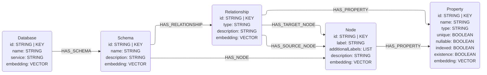

# Neo4j Connector

## Overview

This connector reads a **source Neo4j instance's schema** — its node labels,
relationship types, and properties — and records it in this library's graph data
model. It reads the schema via APOC's
[`apoc.meta.schema()`](https://neo4j.com/docs/apoc/current/overview/apoc.meta/apoc.meta.schema/)
and maps it onto the **LPG (Labeled Property Graph)** data model
(`neocarta.data_model.schema.lpg`), so an agent can see how a graph database is
organized the way the other connectors expose relational sources.

The source Neo4j and the target neocarta graph are both Neo4j, so the connector
takes **two drivers** (they may point at the same instance).

## Connector type

Source connector (ingest only). It provides one data-type sub-connector:

- `Neo4jSchemaConnector` — a source Neo4j's schema → `Database` / `Schema` /
  `Node` / `Relationship` / `Property`.

## Data model

Maps a source Neo4j onto the LPG data model: the source DBMS → `Database` (named
by the caller), the introspected database → `Schema`, each node label → `Node`,
each relationship type → `Relationship`, and each property key → `Property`
(owner-scoped, carrying its `type` and `unique` / `indexed` / `existence` flags).



## Usage

```python
import os

from neo4j import GraphDatabase

from neocarta.connectors.neo4j import Neo4jSchemaConnector

# Read the schema from the source Neo4j; write the neocarta graph to the target.
source_driver = GraphDatabase.driver(
    os.getenv("SOURCE_NEO4J_URI"),
    auth=(os.getenv("SOURCE_NEO4J_USERNAME"), os.getenv("SOURCE_NEO4J_PASSWORD")),
)
target_driver = GraphDatabase.driver(
    os.getenv("NEO4J_URI"),
    auth=(os.getenv("NEO4J_USERNAME"), os.getenv("NEO4J_PASSWORD")),
)

Neo4jSchemaConnector(
    source_neo4j_driver=source_driver,
    neo4j_driver=target_driver,
    source_name="prod-neo4j",       # names the source DBMS (the Database node id)
    database_name="neo4j",          # target neocarta database
).ingest(source_database="neo4j")   # which source database to introspect
```

**Environment variables:** `SOURCE_NEO4J_URI` / `SOURCE_NEO4J_USERNAME` /
`SOURCE_NEO4J_PASSWORD` for the source; `NEO4J_URI` / `NEO4J_USERNAME` /
`NEO4J_PASSWORD` / `NEO4J_DATABASE` for the target.

**Filtering:** `ingest()` / `extract()` accept `include_nodes` and
`include_relationships` (the shared `NodeLabel` / `RelationshipType` enums) to load
a subset — e.g. `include_nodes=[NodeLabel.NODE, NodeLabel.RELATIONSHIP]` to skip
properties.

A runnable example lives in [`examples/neo4j_schema.py`](../../../examples/neo4j_schema.py).

## Source-specific setup

The **source** Neo4j must have the **APOC (Core) plugin** installed, and the role
used to connect must be allowed to call `apoc.meta.schema()`. The connector runs a
pre-flight check and raises a clear `ConfigError` (with an install hint) if APOC is
absent. APOC Core ships with the official Neo4j Docker image and is enabled with
`NEO4J_PLUGINS='["apoc"]'`.

## Known issues / limitations

- **APOC is required on the source** (see above).
- **Per-label schema view.** `apoc.meta.schema()` reports schema per single label,
  so a multi-label node is represented as one `Node` per label and
  `additionalLabels` is not populated. Multi-label combinations are out of scope
  for this first implementation.
- **Existence constraints are Enterprise-only**, so `Property.existence` is always
  `False` against Community Edition (and `nullable` defaults to `True`).
- **Schema only** — the connector reads the schema, not instance data; it produces
  no `Value` nodes.
- **Re-ingest is additive.** Loads MERGE by id and never delete, so re-running
  updates the description in place.
- **Use a separate database (or instance) for the target.** For idempotent
  re-runs, write the neocarta graph to a **different database or instance** than the
  source. When the source and target are the same database, a *re*-ingest also sees
  the connector's own LPG labels (`Node` / `Relationship` / `Property` / `Database` /
  `Schema`) from the previous run and describes them as source schema. The
  `__neocarta_graph__` metadata singleton is excluded automatically, but the LPG
  labels are not (they may collide with real source labels). On Neo4j Community
  (single database), use a separate instance for the target.
- **The caller owns both drivers.** `close()` is a no-op and never closes either
  driver; the caller is responsible for their lifecycle.
