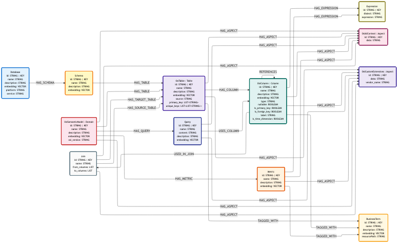

# OSI Connector

Bidirectional connector for the
[Open Semantic Interchange (OSI)](https://github.com/open-semantic-interchange/OSI)
spec — a YAML-based interchange format for semantic models.

- **Ingest** — read an OSI YAML spec (local file or HTTP(S) URL) and load it into Neo4j as an `OsiSemanticModel` subgraph.
- **Export** — read an `OsiSemanticModel` subgraph from Neo4j by name and emit an OSI YAML spec.

## Data model



The mermaid source lives at
[`assets/mermaid/data_model/osi-data-model-1.mmd`](../../../assets/mermaid/data_model/osi-data-model-1.mmd)
and is rebuilt via `make refresh-mermaid-data-model-images`.

OSI-specific node labels (`OsiSemanticModel`, `OsiTable`, `OsiColumn`,
`OsiAiContext`, `OsiCustomExtensions`) are *secondary* labels layered on top of
their primary label (`Domain`, `Table`, `Column`, `Aspect`). So an OsiTable is
stored as `(:Table:OsiTable)` and traversals over `(:Table)` reach OSI-ingested
data the same as data ingested by any other connector.

## Usage

```python
from neo4j import GraphDatabase

from neocarta.connectors.osi import OsiConnector

driver = GraphDatabase.driver("bolt://localhost:7687", auth=("neo4j", "password"))
connector = OsiConnector(neo4j_driver=driver, database_name="neo4j")

# Ingest an OSI spec — local path or HTTP(S) URL (raw.githubusercontent.com etc.).
connector.ingest("path/to/spec.yaml")
connector.ingest("https://raw.githubusercontent.com/.../spec.yaml")

# Export a semantic model from Neo4j back to OSI YAML.
connector.export(semantic_model_name="my_model", output_path="out.yaml")
```

A runnable end-to-end example lives at
[`examples/osi_connector.py`](../../../examples/osi_connector.py).

## Sample dataset

[`datasets/osi/acme_semantic_model.yaml`](../../../datasets/osi/acme_semantic_model.yaml)
is the full 33-table ACME Corp warehouse modeled as OSI, exercising relationships,
metrics, joins with composite keys, and `ai_context` synonyms.

## Behavior

### `dataset.source` must be 3-part or a query

Per the OSI spec, `dataset.source` is either a 3-part `database.schema.table`
identifier or a SQL query. The ingest transformer **raises `ValueError`** on
1-part / 2-part sources to surface spec-non-compliant input early.

- 3-part: emits `Database`, `Schema`, `OsiTable` and the `HasSchema` / `HasTable` /
  `(Domain)-[:HAS_TABLE]->(Table)` edges.
- Query: emits a `Query` node with the SQL preserved as `Query.content`, attached
  to the semantic model via `(Domain)-[:HAS_QUERY]->(Query)`. Projected fields
  attach via `(Query)-[:USES_COLUMN]->(Column)` — same rel type used by the
  query_log connector.

### Synonyms become BusinessTerms

When a field / table / column carries `ai_context: {synonyms: [...]}`, each
synonym is upserted as a `BusinessTerm` and tagged via `TAGGED_WITH`. BTs
**MERGE on `name`**, so synonyms collide cleanly with catalog-derived BTs
from connectors like Dataplex — pre-existing nodes keep their original `id`.

### `is_time_dimension` is tri-state

| OSI input | `OsiColumn.is_time_dimension` | Graph property | YAML export |
|---|---|---|---|
| `dimension: {is_time: true}` | `True` | stored | `dimension: {is_time: true}` |
| `dimension: {is_time: false}` | `False` | stored | `dimension: {is_time: false}` |
| (no `dimension` key) | `None` | not stored | (no `dimension` key) |

### Composite-key joins preserve column order

Each `Join` node carries the original `from_columns` and `to_columns` lists as
ordered string arrays, so `[col_a, col_b] → [col_a, col_b]` pairing is preserved
on round-trip. Positional `(Column)-[:REFERENCES]->(Column)` edges are also
emitted for FK-style graph traversal.

### YAML output fidelity

Exports follow the formatting conventions used in upstream OSI samples:

- Simple string lists (`primary_key`, `from_columns`, `to_columns`, each entry of
  `unique_keys`) render in flow style: `primary_key: [a, b]`.
- `ai_context` parses back to native YAML structure (dict/list), not a quoted JSON string.
- `custom_extensions[].data` renders as a YAML literal block (`|`) with pretty-printed JSON.

## Package layout

```
osi/
├── connector.py          # OsiConnector orchestration
├── load.py               # OsiNeo4jLoader: secondary-label loaders + BT MERGE-on-name
├── ingest/
│   ├── extract.py        # OsiSpecExtractor: load YAML from path or URL
│   └── transform.py      # OsiIngestTransformer: OSI dict → graph models
└── export/
    ├── extract.py        # OsiGraphExtractor: Cypher reads filtered by semantic model name
    └── transform.py      # OsiExportTransformer: graph snapshot → OSI dict → YAML
```
