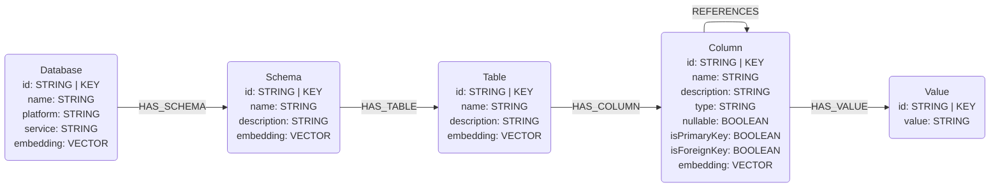
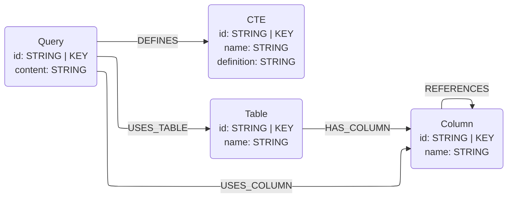

# Snowflake Connector

## Overview

This connector reads metadata from **Snowflake** into this library's graph data
model. It provides two sub-connectors:

- **Schema** — structural metadata (`Database` / `Schema` / `Table` / `Column` /
  `Value` and the `HAS_*` / `REFERENCES` edges) read from a database's
  [`INFORMATION_SCHEMA`](https://docs.snowflake.com/en/sql-reference/info-schema)
  views over the official
  [`snowflake-connector-python`](https://pypi.org/project/snowflake-connector-python/)
  (a pure-Python DB-API 2.0 client). **No Spark, no JDBC** — the extractor issues
  plain `SELECT ... FROM <database>.INFORMATION_SCHEMA.*` queries and pulls the
  results into pandas with `cursor.fetch_pandas_all()`, mirroring the BigQuery /
  Databricks schema connectors.
- **Query logs** — query history (`Query` / `CTE` and their `USES_TABLE` /
  `USES_COLUMN` / `DEFINES` edges, plus the RDBMS scaffolding they reference)
  parsed from `SNOWFLAKE.ACCOUNT_USAGE.QUERY_HISTORY`.

Both sub-connectors live behind the optional `snowflake` extra:

```bash
pip install neocarta[snowflake]
```

The caller constructs and owns the `snowflake.connector` connection (mirroring how
the BigQuery connector takes a `client`); `close()` is a no-op and never closes it.

> **Identifier case.** Snowflake stores unquoted identifiers upper-cased. Pass
> `database` / `schema` names in the case Snowflake stores them (upper-case unless
> the objects were created with quoted, case-sensitive names). Generated node ids
> are normalized (lower-cased) so they stay consistent regardless of source case.

## Connector type

Source connector (ingest only). It provides two data-type sub-connectors:

- `SnowflakeSchemaConnector` — `INFORMATION_SCHEMA` →
  `Database` / `Schema` / `Table` / `Column` / `Value`.
- `SnowflakeLogsConnector` — `ACCOUNT_USAGE.QUERY_HISTORY` → `Query` / `CTE` and
  the tables/columns they reference.

---

# Schema sub-connector

## Data model

Maps Snowflake onto the **core** RDBMS data model
(`neocarta.data_model.schema.rdbms`): a database → `Database`, a schema →
`Schema`, tables and views → `Table`, columns → `Column`, and sampled distinct
values → `Value`. Declared primary/foreign keys set the column key flags and
produce `REFERENCES` edges.



`Database` nodes carry `platform="SNOWFLAKE"` and `service="SNOWFLAKE"`.

## Usage

```python
import os
import snowflake.connector
from neo4j import GraphDatabase
from neocarta.connectors.snowflake import SnowflakeSchemaConnector

neo4j_driver = GraphDatabase.driver(
    uri=os.getenv("NEO4J_URI"),
    auth=(os.getenv("NEO4J_USERNAME"), os.getenv("NEO4J_PASSWORD")),
)

# The caller builds and owns the connection (mirroring how the BigQuery connector
# takes a client); the connector never closes it.
connection = snowflake.connector.connect(
    account=os.getenv("SNOWFLAKE_ACCOUNT"),
    user=os.getenv("SNOWFLAKE_USER"),
    password=os.getenv("SNOWFLAKE_PASSWORD"),
    warehouse=os.getenv("SNOWFLAKE_WAREHOUSE"),
    role=os.getenv("SNOWFLAKE_ROLE"),           # optional
    database=os.getenv("SNOWFLAKE_DATABASE"),
)

connector = SnowflakeSchemaConnector(
    connection=connection,
    database=os.getenv("SNOWFLAKE_DATABASE"),   # analog of BigQuery project_id
    neo4j_driver=neo4j_driver,
    database_name=os.getenv("NEO4J_DATABASE", "neo4j"),
)
connector.ingest(schema=os.getenv("SNOWFLAKE_SCHEMA"))  # one schema per call

connection.close()  # the caller owns the connection's lifecycle
```

Pass `value_sample_limit=0` to skip value sampling entirely (see *Known issues*).

### Environment variables

The connector reads no environment variables itself — build the connection and
Neo4j driver from your own config (the example reads them from the environment).

* `NEO4J_URI`, `NEO4J_USERNAME`, `NEO4J_PASSWORD`, `NEO4J_DATABASE` — Neo4j connection.
* `SNOWFLAKE_ACCOUNT` — account identifier, e.g. `xy12345.us-east-1`.
* `SNOWFLAKE_USER`, `SNOWFLAKE_PASSWORD` — credentials.
* `SNOWFLAKE_WAREHOUSE` — warehouse used to run the metadata queries.
* `SNOWFLAKE_ROLE` — role to assume (optional).
* `SNOWFLAKE_DATABASE`, `SNOWFLAKE_SCHEMA` — the database (Database) and schema to ingest.

#### CLI authentication

The library connector takes a caller-built connection, so you authenticate however
you like when constructing it. The **CLI** (`neocarta snowflake …`) builds the
connection for you and supports three auth methods (precedence: key-pair >
authenticator > password):

* **Key-pair** — `SNOWFLAKE_PRIVATE_KEY_PATH` (PEM private key) [+
  `SNOWFLAKE_PRIVATE_KEY_PASSPHRASE` if encrypted]. **Required on MFA-enforced
  accounts**, where Snowflake blocks password auth for programmatic/driver access.
  Register the public key with `ALTER USER <user> SET RSA_PUBLIC_KEY='…'`.
* **Authenticator** — `SNOWFLAKE_AUTHENTICATOR` (e.g. `externalbrowser`, `oauth`,
  `PROGRAMMATIC_ACCESS_TOKEN`) with an optional `SNOWFLAKE_TOKEN`.
* **Password** — `SNOWFLAKE_PASSWORD` (only where programmatic password auth is allowed).

### `INFORMATION_SCHEMA` views / commands read

All scoped to the target `<database>`:

| Stage | Source |
|---|---|
| schema info | `INFORMATION_SCHEMA.SCHEMATA` |
| table info | `INFORMATION_SCHEMA.TABLES` (base tables + views) |
| column info | `INFORMATION_SCHEMA.COLUMNS`, plus `SHOW PRIMARY KEYS` / `SHOW IMPORTED KEYS` for PK/FK flags |
| references | `SHOW IMPORTED KEYS IN SCHEMA` (FK → referenced PK) |
| value samples | `SELECT ARRAY_SLICE(ARRAY_AGG(DISTINCT "col"), 0, n)` per groupable column |

Snowflake's `INFORMATION_SCHEMA` does **not** expose a `KEY_COLUMN_USAGE` view, so
primary- and foreign-key *columns* come from the `SHOW PRIMARY KEYS` /
`SHOW IMPORTED KEYS` commands rather than a constraint-view join.

### Filtering options

There is no `include_nodes` / `include_relationships` filtering in this version
(matching the BigQuery / Databricks schema connectors); `ingest(schema=...)`
produces the full graph shape above. The one knob is `value_sample_limit` (a
data-read cost/PII control, not a graph-entity filter).

## Source-specific setup

1. A running **warehouse** the role can use for queries, plus a role that can read
   the target database's `INFORMATION_SCHEMA` and run `SHOW ... KEYS` (and read the
   table data, if value sampling is enabled).
2. Build the `snowflake.connector` connection and pass it to the connector.

## Known issues / limitations

- **One schema per call.** `ingest(schema=...)` ingests a single schema, like the
  BigQuery connector's per-dataset model; loop over schemas to ingest several.
- **Value sampling reads table data.** It is on by default (`value_sample_limit=10`)
  and is the only stage that reads actual table *data* rather than
  `INFORMATION_SCHEMA` — it incurs warehouse compute, needs data-read grants beyond
  the metadata, and can surface PII. Pass `value_sample_limit=0` to skip it (no
  `:Value` nodes / `HAS_VALUE` edges). Complex/non-groupable column types
  (VARIANT/OBJECT/ARRAY/MAP/GEOGRAPHY/GEOMETRY/VECTOR) are skipped automatically —
  these are non-groupable, so `ARRAY_AGG(DISTINCT …)` on them would fail.
- **Re-ingest is additive.** Re-running against the same schema adds newly-created
  tables/columns/values, but does **not** refresh changed metadata (e.g. an edited
  comment or type) and does **not** remove dropped objects — the shared
  `Neo4jRDBMSLoader` MERGEs with `ON CREATE` semantics and never deletes. Clear the
  affected subgraph before re-ingesting to make the graph faithful to a changed source.
- **Keys are informational.** Snowflake primary/foreign keys are *not enforced* and
  appear only when tables declare constraints; without declared keys, column key
  flags stay `False` and no `REFERENCES` edges are produced.
- **Missing schema fails fast.** If `INFORMATION_SCHEMA.SCHEMATA` returns no row for
  the requested schema (a typo — remember Snowflake's upper-casing — or the role
  can't see it), the connector raises a `ConfigError` rather than synthesizing an
  empty schema.
- **Cross-schema foreign keys resolve; cross-database are skipped.** A `REFERENCES`
  edge uses the foreign key's own database/schema for the source column and the
  *referenced* table's database/schema for the target, so a foreign key pointing at a
  table in a different **schema of the same database** resolves correctly. A foreign
  key whose referenced table lives in a **different database** is skipped (with a
  logged warning): the connector ingests one database at a time, so that referenced
  table — and its `:Column` node — is not part of the graph anyway.

---

# Query-logs sub-connector

## Data model

Parses statement text from `SNOWFLAKE.ACCOUNT_USAGE.QUERY_HISTORY` (via `sqlglot`,
`read="snowflake"`) into `Query` / `CTE` nodes and the tables/columns each query
references. Reuses the shared `QueryLogTransformer` — identical to the BigQuery
logs connector, only the extraction source differs.



## Usage

```python
import os
import snowflake.connector
from neo4j import GraphDatabase
from neocarta.connectors.snowflake import SnowflakeLogsConnector

neo4j_driver = GraphDatabase.driver(
    uri=os.getenv("NEO4J_URI"),
    auth=(os.getenv("NEO4J_USERNAME"), os.getenv("NEO4J_PASSWORD")),
)
connection = snowflake.connector.connect(
    account=os.getenv("SNOWFLAKE_ACCOUNT"),
    user=os.getenv("SNOWFLAKE_USER"),
    password=os.getenv("SNOWFLAKE_PASSWORD"),
    warehouse=os.getenv("SNOWFLAKE_WAREHOUSE"),
    database=os.getenv("SNOWFLAKE_DATABASE"),
)

SnowflakeLogsConnector(
    connection=connection,
    database=os.getenv("SNOWFLAKE_DATABASE"),
    neo4j_driver=neo4j_driver,
    database_name=os.getenv("NEO4J_DATABASE", "neo4j"),
).ingest(schema=os.getenv("SNOWFLAKE_SCHEMA"), limit=500)

connection.close()
```

## Source-specific setup

Reading `SNOWFLAKE.ACCOUNT_USAGE.QUERY_HISTORY` requires access to the shared
`SNOWFLAKE` database (`GRANT IMPORTED PRIVILEGES ON DATABASE SNOWFLAKE ...`, held
by `ACCOUNTADMIN` by default).

## Known issues / limitations

- **`ACCOUNT_USAGE` latency and privileges.** `ACCOUNT_USAGE.QUERY_HISTORY` can lag
  live activity by up to ~45 minutes and needs `IMPORTED PRIVILEGES` on the
  `SNOWFLAKE` database. `INFORMATION_SCHEMA.QUERY_HISTORY()` (last 7 days, lower
  privilege) is a documented lower-latency fallback.
- **Lineage is parsed from query text.** Tables/columns come from parsing
  `QUERY_TEXT` (session `DATABASE_NAME` scopes the read), not from
  `ACCESS_HISTORY.objects_accessed`; unparseable statements are skipped.
- **`schema` is optional but recommended.** Passing `schema=` both filters the
  history and provides the default schema for resolving unqualified table names;
  without it, only fully qualified references resolve.
