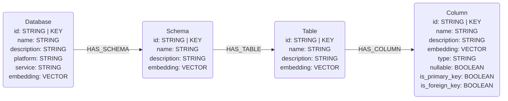

# Unity Catalog Connector

## Overview

This connector reads schema metadata from the **open** [Unity Catalog](https://www.unitycatalog.io/)
REST API (`/api/2.1/unity-catalog`, the Apache-2.0 project at
[github.com/unitycatalog/unitycatalog](https://github.com/unitycatalog/unitycatalog)) and maps it to the
graph data model defined in this library. It speaks the vendor-neutral open API over a plain HTTP client
— **not** the Databricks SDK — so it works against any conformant Unity Catalog server: a local OSS
server, a self-hosted deployment, or a managed one. No cluster or warehouse is required, only a base URL
and an optional bearer token.

## Connector type

Source connector (ingest only). It currently provides one data-type sub-connector:

- `UnityCatalogSchemaConnector` — catalog / schema / table / column structural metadata.

A glossary sub-connector is planned as a follow-up. The open REST API has no tag/glossary concept, so
glossary terms will be sourced from the Unity Catalog `INFORMATION_SCHEMA` tables (a separate SQL access
path), not from this REST API.

## Data model

Catalogs map to `Database`, schemas to `Schema`, tables and views to `Table` (the Unity Catalog
`table_type` is recorded during extraction but views are not modeled as a distinct node label), and each
table's embedded columns to `Column`.

The open Unity Catalog API exposes **no** primary-key, foreign-key, or other constraint metadata, so no
`REFERENCES` edges are produced and every column is loaded with `is_primary_key=False` and
`is_foreign_key=False`.



## Usage

```python
import os
from neo4j import GraphDatabase
from neocarta.connectors.unity_catalog import UnityCatalogSchemaConnector

neo4j_driver = GraphDatabase.driver(
    uri=os.getenv("NEO4J_URI"),
    auth=(os.getenv("NEO4J_USERNAME"), os.getenv("NEO4J_PASSWORD")),
)

# The connector owns its HTTP client; use it as a context manager (or call
# connector.close()) to release the connection pool when done.
with UnityCatalogSchemaConnector(
    base_url=os.getenv("UC_SERVER_URL", "http://localhost:8080/api/2.1/unity-catalog"),
    token=os.getenv("UC_TOKEN"),  # optional; None for a local OSS server
    neo4j_driver=neo4j_driver,
    database_name=os.getenv("NEO4J_DATABASE", "neo4j"),
) as connector:
    connector.ingest(catalog="unity")      # optional: schemas=["default", ...]
```

### Environment variables

The connector itself reads no environment variables — pass `base_url` and `token` explicitly (the example
above reads them from the environment in caller code). The Neo4j connection variables follow the rest of
the library:

* `NEO4J_URI` — Neo4j connection URI (e.g. `bolt://localhost:7687`).
* `NEO4J_USERNAME` — Neo4j username (default: `neo4j`).
* `NEO4J_PASSWORD` — Neo4j password.
* `NEO4J_DATABASE` — Neo4j database name (default: `neo4j`).

Suggested (caller-supplied) Unity Catalog variables: `UC_SERVER_URL` for `base_url` and `UC_TOKEN` for
`token`. `base_url` must include the API version prefix, e.g.
`http://localhost:8080/api/2.1/unity-catalog`.

### Filtering options

Extraction can be scoped with the shared `include_nodes` / `include_relationships` enums on `extract()`
and `ingest()`:

* `include_nodes` — any of `NodeLabel.DATABASE`, `NodeLabel.SCHEMA`, `NodeLabel.TABLE`, `NodeLabel.COLUMN`.
* `include_relationships` — any of `RelationshipType.HAS_SCHEMA`, `RelationshipType.HAS_TABLE`,
  `RelationshipType.HAS_COLUMN`.

`None` (the default) includes everything available. Tables are fetched transiently to attach columns even
when `TABLE` is excluded, because columns are embedded in the tables payload. The `schemas` argument
applies a client-side filter to restrict ingestion to specific schemas.

## Source-specific setup

1. Run or point at a Unity Catalog server exposing the open REST API. A local OSS server
   (`bin/start-uc-server`) listens on `http://localhost:8080` and requires no authentication by default.
2. If the server enforces auth, obtain a bearer token and pass it via `token=` (sent as
   `Authorization: Bearer <token>`).
3. Identify the `catalog` name to ingest (and optionally the `schemas` to restrict to).

## Known issues / limitations

- **No keys / `REFERENCES` edges.** The open Unity Catalog API exposes no primary/foreign-key or
  constraint metadata, so column key flags stay `False` and no `REFERENCES` edges are produced.
- **No tags / business terms / glossary.** The open REST API has no tag concept. Glossary support is a
  planned follow-up sourced from `INFORMATION_SCHEMA`, not this connector.
- **No value sampling.** No `Value` nodes or `HAS_VALUE` edges are produced.
- **Views are not a distinct node type.** Tables and views both become `Table` nodes.
- **Client-side schema filtering.** The `schemas` argument filters after listing; it does not push the
  filter to the server.
