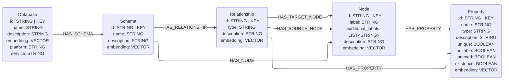

# Labeled Property Graph Structural Data Model

The structural components for a Labeled Property Graph (LPG) metadata graph.

**The data model components defined in this document are subject to change throughout development.**

> **Warning:** Importing this module raises a `UserWarning`: *"LPG data model components are an in-progress feature. There is no application in the current library version."*

## Core Data Model **(Not Implemented)**

The core data model represents the metadata structure of a Labeled Property
Graph database. It consists of five nodes and seven relationships.

Nodes
* `Database`
    * Top level node containing information about the graph database
    * Properties: id, name, description, embedding, platform, service
* `Schema`
    * Contains details about the database schema or namespace
    * Properties: id, name, description, embedding
* `Node`
    * Represents a node label in the LPG
    * Properties: id, label, additional_labels, description, embedding
* `Relationship`
    * Represents a relationship type in the LPG
    * Properties: id, type, description, embedding
* `Property`
    * Represents a property that can exist on nodes or relationships
    * Properties: id, name, type, description, unique, nullable, indexed, existence, embedding

Relationships
* `(:Database)-[:HAS_SCHEMA]->(:Schema)`
* `(:Schema)-[:HAS_NODE]->(:Node)`
* `(:Schema)-[:HAS_RELATIONSHIP]->(:Relationship)`
* `(:Relationship)-[:HAS_SOURCE_NODE]->(:Node)`
* `(:Relationship)-[:HAS_TARGET_NODE]->(:Node)`
* `(:Node)-[:HAS_PROPERTY]->(:Property)`
* `(:Relationship)-[:HAS_PROPERTY]->(:Property)`

## Property Values **(Not Implemented)**

Property values are represented by the shared
[`instance.Value`](../../instance/README.md) node. The LPG-specific
`(:Property)-[:HAS_VALUE]->(:Value)` edge is not yet implemented and will be
added when the LPG track is built out; the relational
`(:Column)-[:HAS_VALUE]->(:Value)` edge lives in the `instance` module today.

## Glossary, Stewards, Rules, Queries, Metrics **(Not Implemented)**

The LPG equivalents of the glossary, steward, rule, query, and metric concerns
are planned but not yet implemented. The relational implementations of these
concerns live in the [`glossary`](../../glossary/README.md),
[`query`](../../query/README.md), and [`osi`](../../osi/README.md) modules.
